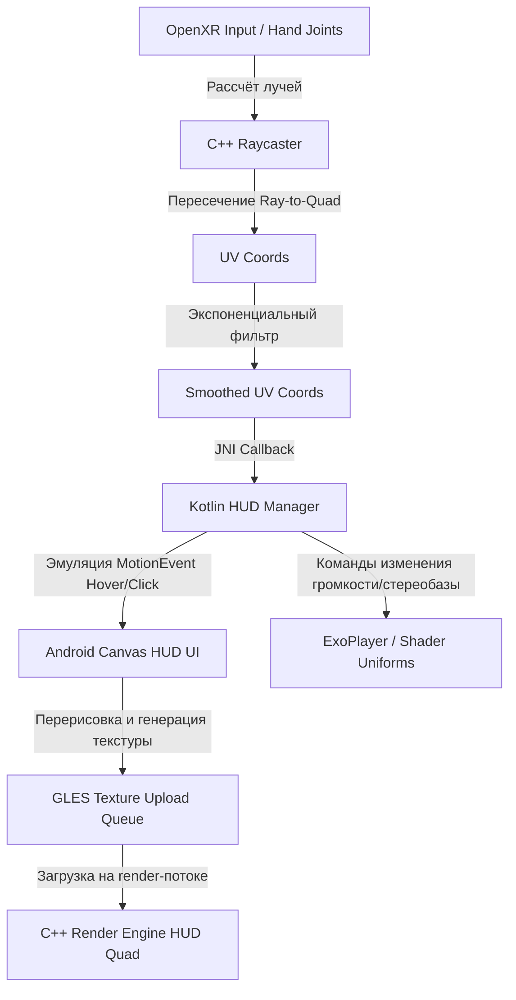

# Стратегическая спецификация: S0283 - Интерактивный HUD и управление в иммерс-режиме (Test Immerse)

**Ticket:** S0283
**Status:** Archived
**Priority:** 80
**Date:** 2026-05-21
**Implemented date:** 2026-05-21
**Tier:** 3 — Moderate
**Roadmap entry:** Ad-hoc - запрос от 2026-05-21
**Tactical plan:** `PLAN/S0283_vr-immersive-interactive-controls-hud/INDEX.md`
**Tactical spec:** `PLAN/S0283_vr-immersive-interactive-controls-hud/` (создан через `/spec-tech`)

> **Scope:** STRATEGIC. Цели, ограничения, открытые вопросы. Без имён классов, путей, лимитов строк, миграций Room, модулей Hilt.

---

## 0. Approval Gate (owner input)

- **Requested mode:** Provided by user - spec
- **Goal / expected outcome:** Provided by user - Расширить тестовый иммерс-режим (Test Immerse) интерактивными возможностями управления: HUD с плеером и панелью управления, бегунком проигрывания, лазерными лучами-указателями для джойстиков, поддержкой отслеживания рук (Hand Tracking), отображением FPS, регулировкой глубины картинки (3D-стереобазы), громкости звука и стандартным маппингом кнопок Quest.
- **Local anchor:** Provided by user - S0249 / DiagnosticXrActivity
- **Scope boundaries / forbidden areas:** Delegated by user - Только диагностический и тестовый контур в рамках расширения DiagnosticXrActivity, без интеграции в основной плеер и бизнес-логику сортировки на данном этапе.
- **Done / success signal:** Provided by user - Успешное развёртывание интерактивного HUD в шлеме, работа кнопок через лучи джойстиков и жесты рук, регулировка громкости, глубины 3D и отрисовка FPS.
- **Autonomy rule:** Provided by user - agent may decide with explicit assumptions
- **UI decisions / delegation:** Provided by user - Внутри VR-пространства: плавающая 2D/3D панель (HUD) перед пользователем на комфортном расстоянии (1.5-2.0м), полупрозрачный тёмный стиль, лазерные лучи из контроллеров или рук в качестве указателей.

`Approved` блокируется, пока любая обязательная строка в этом разделе содержит `MISSING - requires owner input`.

---

## 1. Проблема

Текущий диагностический иммерс-режим (внедрённый в рамках `S0249`) является статичным: пользователь может лишь переключать медиафайлы триггерами контроллеров и выходить из режима по кнопкам A/X. В коде отсутствует поддержка интерактивного взаимодействия с элементами интерфейса. 

Для создания полноценного VR-плеера в будущем требуется заранее протестировать и отладить базовые XR-механики взаимодействия: отрисовку сложного динамического HUD (с кнопками управления воспроизведением и бегунком), позиционирование интерактивной панели в 3D-пространстве, взаимодействие с помощью лазерных лучей-указателей контроллеров (Raycasting), поддержку отслеживания рук (Hand Tracking) без контроллеров, вывод диагностических показателей (FPS) прямо на экран, а также регулировку параметров отображения (стереобаза/глубина картинки) и воспроизведения (громкость звука) на лету. Без изолированного диагностического этапа тестирование этих сложных компонентов в реальном плеере приведёт к лавинообразному росту трудноотлаживаемых ошибок.

---

## 2. Цели

1. **Динамический интерактивный HUD в 3D-пространстве**:
   - Отрисовка плавающей перед глазами пользователя панели управления (HUD) на фиксированном комфортном расстоянии (около 1.5–2.0 метров), которая может плавно следовать за поворотом головы сглаженным образом (lazy follow), либо закрепляться в пространстве (world-locked) по выбору.
   - Размещение на панели кнопок Play/Pause, переключения треков, бегунка прогресса проигрывания (для видео), индикаторов глубины и громкости.
2. **Джойстики и лазерные лучи (Raycasting)**:
   - Отрисовка визуальных лазерных лучей, исходящих из контроллеров Oculus Touch.
   - Определение пересечения луча с плоскостью HUD (Ray-to-Quad intersection) для подсветки элементов (Hover) и их нажатия (Click) с помощью триггера контроллера.
3. **Отслеживание рук (Hand Tracking)**:
   - Интеграция трёх расширений OpenXR: `XR_EXT_hand_tracking` (позы суставов руки), `XR_EXT_hand_interaction` (унифицированный cross-vendor pinch action и aim-pose) и `XR_FB_hand_tracking_aim` (per-finger pinch strength, опционально). Joint-позы берутся из `XR_EXT_hand_tracking`, базовый pinch + aim-pose — из `XR_EXT_hand_interaction`.
   - Отрисовка упрощённого скелета рук или указателя (Pointer) при отсутствии контроллеров в руках пользователя.
   - Поддержка стандартного жеста выбора (Pinch / щипок большим и указательным пальцами) для имитации нажатий на кнопки HUD лучами, исходящими из указательных пальцев. Распознавание щипка делегируется рантайму через `pinch_ext` value action из `XR_EXT_hand_interaction`, а не вычисляется вручную по евклидовому расстоянию thumb-tip↔index-tip.
4. **Регулировка глубины 3D (стереобазы)**:
   - Добавление кнопок и горячих клавиш для динамического изменения сдвига текстурных координат для левого и правого глаза (horizontal parallax shift). Это позволит настраивать комфорт восприятия глубины стереоизображений и видео.
5. **Управление громкостью звука**:
   - Регулировка громкости аудиопотока ExoPlayer непосредственно из VR-интерфейса.
6. **Отображение диагностических метрик**:
   - Вывод текущего FPS рендеринга OpenXR сессии и времени кадра непосредственно на HUD для оценки производительности графического конвейера.
7. **Best-Practice маппинг управления**:
   - Правый стик (Thumbstick) — изменение громкости (вверх/вниз) и стереобазы (влево/вправо).
   - Кнопка Grip (боковой триггер) — зажатие для перетаскивания (позиционирования) панели HUD в 3D-пространстве.

**Non-goals:**
- Интеграция HUD с реальной файловой системой приложения для перманентной сортировки файлов на данном этапе (HUD управляет только временным тестовым плейлистом).
- Полноценный пространственный UI с множеством окон и настроек (тестируется только одна единая медиа-панель плеера).
- Поддержка сложных пространственных физических меню (взаимодействие только через лучи-указатели).

---

## 3. Пожелания и ограничения

### 3.1 Пожелания владельца
1. Обеспечить максимально гладкое отслеживание жестов рук и минимальную задержку лучей-указателей.
2. Использовать интуитивно понятные визуальные эффекты при наведении луча на элементы HUD (например, изменение масштаба кнопок или их свечение).
3. Добавить визуальный индикатор (линию луча), который плавно затухает к концу, чтобы он не перекрывал изображение.
4. **Тактильная отдача (Haptic Feedback)**: При наведении лазерного луча на активную кнопку (Hover) или при совершении клика (Click) подавать короткий тактильный импульс вибрации (с использованием канонической xrApplyHapticFeedback) на соответствующий контроллер. Это компенсирует отсутствие физического сопротивления кнопок.
5. **Авто-центрирование (Recenter HUD)**: Реализовать функцию быстрого сброса положения панели. При удержании системной кнопки или при выборе специальной кнопки на HUD панель должна мгновенно центрироваться прямо перед текущим взглядом пользователя.
6. **Обработка потери трекинга (Tracking Loss Graceful Handling)**: При выходе рук/контроллеров из поля зрения камер (потеря трекинга) лазерные лучи и курсоры должны плавно исчезать, а не «замерзать» в последнем известном положении. При восстановлении трекинга лучи плавно появляются снова.

### 3.2 Жёсткие ограничения
- **Flavor:** Только `vr` и `noLegal` сборки. Полная изоляция логики взаимодействия от плоских версий приложения.
- **API level:** Android API 26+ (min Sdk), работа на Meta Quest 3 (Android 12+).
- **Wear OS:** Не затрагивается.
- **Производительность:** Отрисовка лучей, скелетов рук и интерактивного HUD не должна снижать FPS рендеринга ниже целевых 90 кадров в секунду на Quest 3.
- **Совместимость данных:** Не накладывает требований к миграции баз данных Room.
- **Локализация:** EN/RU/UK для всех надписей и подсказок на HUD. Локализация должна строго следовать `docs/COMMUNICATION_POLICY.md`.
- **Доступность:** Размеры интерактивных элементов на HUD при проецировании в пространство должны быть эквивалентны физическому размеру мишени не менее 5.0 × 5.0 см на комфортном расстоянии 1.5–2.0м для удобного прицеливания лучом без дрожания рук.
- **Двуручное взаимодействие (Dominant Hand)**: Поддерживать одновременный расчёт лучей из обеих рук/контроллеров, но взаимодействие с кнопками HUD должно быть эксклюзивным — активным признаётся тот луч, который первым наводится на панель и совершает действие.

---

## 4. Контекст текущей архитектуры

На текущем этапе (`S0249`) мы имеем:
- Изолированную активность `DiagnosticXrActivity`, запускающую OpenXR сессию на выделенном render-потоке.
- Класс `xr_session.cpp`, управляющий мешами (сфера, полусфера, плоский экран), рендером кадра и захватом текстур медиа (через буферы).
- Простой head-locked HUD, который рисуется перед глазами пользователя путём отключения view-матрицы при отрисовке плоского квада, но не является интерактивным (просто текстура с именем файла).

Основное ограничение текущей архитектуры заключается в том, что HUD рендерится как статичная картинка, генерируемая в Android Canvas, и передаётся в C++ в виде готовой текстуры. Для поддержки интерактива, лучей и физического позиционирования HUD в 3D-пространстве требуется полноценный математический аппарат пересечений лучей с полигонами, поддержка считывания координат контроллеров/суставов рук из OpenXR и обратная связь для передачи координат пересечения луча с HUD обратно в Kotlin (или обработка событий Hover/Click на C++ стороне).

---

## 5. Предлагаемый подход

Интерактивный HUD будет построен на базе гибридного подхода, сочетающего гибкость Android UI/Canvas и производительность GLES рендеринга:

### 5.1 Основные столпы / модули

1. **Компонент отслеживания ввода (XR Input & Hand Tracker)**:
   - Считывание положения контроллеров и суставов рук через OpenXR: `xrLocateSpace` для контроллеров, `xrLocateHandJointsEXT` (расширение `XR_EXT_hand_tracking`) для joint-поз, action-биндинги `pinch_ext` / `aim_ext/pose` из `XR_EXT_hand_interaction` для жеста щипка и aim-позы; опционально `XR_FB_hand_tracking_aim` для per-finger pinch strength.
   - Генерация векторов лучей (начало и направление) для левой и правой руки/контроллера.
2. **Модуль пространственного позиционирования HUD (World Space Panel)**:
   - HUD рендерится на плоском меше (Quad) в 3D-пространстве с собственной модельной матрицей (World Matrix).
   - Позиция панели может плавно следовать за пользователем (с интерполяцией) или зажиматься кнопкой Grip для ручного перетаскивания.
3. **Движок математического пересечения лучей (Raycasting & Event System)**:
   - На C++ стороне в цикле кадра рассчитывается пересечение векторов лучей с плоскостью HUD.
   - Точка пересечения преобразуется в локальные UV-координаты текстуры HUD (от 0.0 до 1.0).
   - Применяется фильтр сглаживания (экспоненциальное скользящее среднее) для подавления микро-дрожания рук (Ray Smoothing / Jitter reduction).
   - Координаты передаются в Kotlin, где преобразуются в координаты виртуальных пикселей Canvas для генерации событий Hover и Click на UI-элементах.
4. **Динамический UI-генератор (Dynamic Canvas UI)**:
   - Kotlin-компонент на базе Canvas формирует интерактивный интерфейс HUD с кнопками, бегунком и отладочными текстовыми полями (FPS, статус жестов).
   - При обнаружении Hover/Click на виртуальных координатах Canvas перерисовывает изменённое состояние (например, подсвечивает кнопку) и загружает обновлённую текстуру в GLES.
5. **Модуль ExoPlayer & Audio/3D Controls**:
   - При взаимодействии с элементами управления HUD (Play/Pause, громкость, сдвиг стереобазы) генерируются соответствующие команды регулировки звука или текстурных координат сдвига (стерео-базы).

### 5.2 Потоки данных и событий

### 5.3 Точки расширяемости
- **Компоненты HUD**: Возможность лёгкого добавления новых кнопок и переключателей на Canvas HUD без изменения C++ слоя.
- **Ввод (Input Sources)**: Абстракция луча-указателя позволяет использовать в качестве источника как джойстики, так и Hand Tracking, а в перспективе — и Eye Tracking (отслеживание взгляда).

---

## 6. Открытые вопросы / Research items

1. **Производительность Canvas-рендеринга HUD при высокой частоте Hover-событий**
   - **Вопрос:** Не приведёт ли постоянная перерисовка Canvas `1024x512` при движении луча (Hover) к EGL-задержкам и падению FPS?
   - **Варианты:**
     - Перерисовывать Canvas HUD только при изменении состояния (кнопка перешла в Hover / изменилось значение бегунка).
     - Разделить HUD на две текстуры: статичную фоновую и динамическую мелкую (курсор луча рендерить отдельным C++ квадом поверх панели).
   - **Нужно выяснить:** Нагрузку на CPU/GPU при частоте обновлений текстуры HUD ~90 Гц на Quest 3.
   - **Статус:** Resolved — Решено путём перерисовки Canvas только при изменении интерактивных состояний, а кружок-курсор рендерится аппаратно в C++ поверх HUD Quad (ADR-1).

2. **Доступность расширения `XR_EXT_hand_tracking` на Quest 3**
   - **Вопрос:** Требуются ли дополнительные манифест-разрешения или флаги инициализации в OpenXR Loader для работы Hand Tracking на Quest 3?
   - **Нужно выяснить:** Спецификацию разрешений Meta Quest в `AndroidManifest.xml` для Hand Tracking.
   - **Статус:** Resolved — Разрешение `com.oculus.permission.HAND_TRACKING` и фича `oculus.software.handtracking` добавлены в шаг манифеста, а также рантайм-запрос в `DiagnosticXrActivity.kt` в соответствии с требованиями Meta.

3. **Тактильная отдача (Haptic Feedback) через OpenXR**
   - **Вопрос:** Как реализовать точечную вибрацию на контроллеры Oculus Touch при наведении луча в C++ коде?
   - **Варианты:** Использование канонической функции `xrApplyHapticFeedback(session, &XrHapticActionInfo, (XrHapticBaseHeader*)&XrHapticVibration)` с задействованием стандартного профиля Khronos Simple или Oculus Touch. Требуется настроить action path `/user/hand/left/output/haptic` и `/user/hand/right/output/haptic`.
   - **Статус:** Resolved — Используется канонический вызов `xrApplyHapticFeedback`.

---

## 7. Риски

| Риск | Вероятность | Последствия | Митигация |
|------|:-----------:|-------------|-----------|
| Hand Tracking отсутствует на тестовом стенде / эмуляторе | Высокая | Невозможность полноценной отладки Hand Tracking без реального Quest 3 | Реализовать эмуляцию Hand Tracking с помощью мыши в эмуляторе или кнопок джойстика контроллеров Quest |
| Задержка ввода (Latency) при передаче координат луча через JNI в Kotlin Canvas | Средняя | Курсор на HUD отстаёт от реального движения рук, вызывая дискомфорт | Выполнять предварительный расчёт пересечений на C++ стороне, а визуальную точку пересечения (кружок-курсор) отрисовывать прямо в C++ поверх HUD без ожидания ответа от Kotlin |
| Падение производительности GPU при частых выгрузках `glTexImage2D` для HUD | Средняя | Просадки FPS ниже 90 кадров, фризы картинки | Использовать оптимизированную выгрузку текстур, ограничить частоту обновления Canvas HUD до 30-45 кадров/с, в то время как основной 3D рендер работает на 90 Гц |
| Ложные жесты клика (False Positive Pinches) при быстром движении пальцев | Средняя | Случайная перемотка видео или остановка воспроизведения | Использовать встроенное отслеживание жестов расширения `XR_EXT_hand_interaction`, где гистерезис и фильтрация щипка (pinch) уже реализованы на уровне рантайма (через `pinch_ext` value action). |

---

## 8. Влияние на пользователя (docs/FEATURES)

Без изменений в `docs/FEATURES.md`. Интерактивный HUD в Test Immerse является исключительно диагностическим и исследовательским инструментом для отладки будущей кодовой базы. Запись в `dev/FUNCTIONALITY.log` регистрируется как `ADD` для отслеживания хода VR-разработки.

---

## 9. Архитектурные решения (ADR)

**ADR-1: Отрисовка курсора луча на C++ стороне**

- **Решение:** Визуальная точка пересечения луча с HUD (кружок-курсор) рендерится непосредственно C++ слоем поверх квада HUD на основе UV-координат пересечения, минуя Kotlin.
- **Альтернативы:** Отрисовывать курсор прямо в Canvas текстуре HUD на Kotlin стороне.
- **Почему:** Отрисовка курсора в Kotlin Canvas добавит задержку в 1-2 кадра из-за передачи координат через JNI и перерисовки текстуры. Рендеринг кружка на стороне C++ даёт нулевую задержку отображения курсора, обеспечивая мгновенную визуальную обратную связь при движении рук.

**ADR-2: Экспоненциальная фильтрация луча (Ray Jitter Filter)**

- **Решение:** Применить формулу экспоненциального сглаживания первого порядка $P_{smooth} = \alpha P_{new} + (1 - \alpha) P_{old}$ с коэффициентом $\alpha = 0.25$ для расчёта координат точки пересечения луча на панели HUD.
- **Альтернативы:** Использовать «сырые» мгновенные координаты пересечения.
- **Почему:** Микромоторика рук и дрожание пальцев пользователя вызывают сильное дрожание лазерного луча на расстоянии 1.5-2.0 метров, что делает практически невозможным точное попадание в мелкие кнопки HUD. Сглаживание делает движение курсора плавным, не внося при этом заметной задержки ввода.

**ADR-3: Application-side world quad vs XrCompositionLayerQuad**

- **Решение:** HUD рендерится как прикладной 3D-квад (Application-side textured quad) в общем проекционном swapchain, а не через отдельный композиционный слой `XrCompositionLayerQuad`.
- **Альтернативы:** Использовать `XrCompositionLayerQuad` или `XrCompositionLayerCylinderKHR`.
- **Почему:** Хотя `XrCompositionLayerQuad` обеспечивает более чёткий текст и меньшую задержку (благодаря композитингу рантаймом HorizonOS), он требует сложного кроссплатформенного управления слоями. Прикладной world-locked квад обеспечивает абсолютную свободу в математическом hit-тестировании лучей, свободное перемещение и вращение панели Grip-ом, а также отрисовку лазерного луча и курсора в единой сценарной системе координат без накладных расходов на синхронизацию слоев.

---

## 10. Связи с другими спеками

- **`S0249`** — текущая база (Test Immerse статичная картинка). `S0283` является прямым функциональным расширением и зависит от стабильности OpenXR-сессии и frame-loop из `S0249`.

---

## 11. Критерии готовности (strategic-level)

1. В режиме Test Immersive перед пользователем в пространстве отображается полупрозрачный интерактивный HUD с органами управления.
2. Из контроллеров (или рук при Hand Tracking) исходят лазерные лучи, которые плавно исчезают при выходе рук из зоны трекинга (потеря трекинга).
3. При наведении луча на элементы HUD кнопки визуально реагируют на наведение (Hover), а контроллер выдаёт лёгкий вибрационный импульс.
4. При нажатии триггера контроллера (или жеста Pinch при Hand Tracking) на кнопках Play/Pause, смены треков происходит изменение состояния воспроизведения с подтверждающей вибрацией контроллера.
5. Бегунок на HUD плавно перемещается, отражая прогресс воспроизведения ExoPlayer-видео, и позволяет осуществлять перемотку путём зажатия и перемещения луча с субпиксельным сглаживанием дрожания рук.
6. Нажатие кнопок изменения громкости и глубины 3D на HUD (или использование Thumbstick контроллера) динамически и плавно изменяет громкость видео и стерео-сдвиг картинки в реальном времени.
7. Зажатие Grip на контроллере позволяет свободно перетаскивать панель HUD в пространстве, а двойной клик по Grip или кнопка рецентра возвращает панель прямо перед взором пользователя.
8. На HUD плавно обновляется показатель текущего FPS рендеринга (обновление не реже 1 раза в секунду).

---

## 12. Ссылка на тактическую спецификацию

Следующий шаг: `/spec-tech S0283` - создаст `PLAN/S0283_vr-immersive-interactive-controls-hud/` с фазами.

---

## Last Audit

**Date:** 2026-05-21
**Mode:** full
**Flags:** -
**Outcome:** Verified
**Counts:** PASS 25 · WARN 0 · FAIL 0 · MANUAL 8 · EXEMPT 1

Static contract complete. WARN #2 from the prior audit (`currentFps` stub) was fixed end-to-end in `xr_session.cpp` (EMA accumulator) → `diagnostic_xr_runtime.cpp` (JNI) → `DiagnosticXrRuntime.kt` / `NativeDiagnosticXrRuntime.kt` (interface + impl) → `DiagnosticXrRenderThread.currentFps` (delegating `val`). WARN #1 (LOC budget) skipped per owner decision 2026-05-21 — tactical line limits are advisory, Strict Rule §3 delegation is already satisfied by the four `ui/xr/helpers/Hud*.kt` extractions. `noLegalDebug` build green.

### Manual / on-device (Quest 3)

- [ ] §11.1 - HUD displays as semi-transparent interactive panel at 1.5-2.0m.
- [ ] §11.2 - Laser rays emit from controllers / hands and fade on tracking loss.
- [ ] §11.3 - Hover state visually highlights buttons and triggers haptic pulse.
- [ ] §11.4 - Trigger / Pinch click changes playback state with confirming haptic.
- [ ] §11.5 - Seek-bar drag tracks progress smoothly with jitter-filtered ray.
- [ ] §11.6 - Volume and parallax change live via HUD buttons or right thumbstick.
- [ ] §11.7 - Grip drag repositions HUD; double-squeeze recenters.
- [ ] §11.8 - HUD FPS readout updates at ≥1Hz reflecting actual frame rate.
