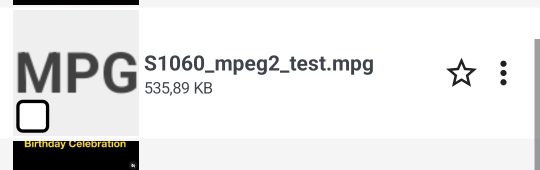

# S1968 evidence extracts

Verdict-bearing extracts. Full logs were disposable (temp/) and are not retained.

## Reproduce

```powershell
pwsh -NoProfile -File scripts/devtest/prerelease-prepare.ps1 -DeviceId emulator-5554 -Json
adb -s emulator-5554 shell appops set --uid com.sza.fastmediasorter.debug MANAGE_EXTERNAL_STORAGE allow
adb -s emulator-5554 logcat -c
adb -s emulator-5554 logcat -v threadtime "*:V" > run.log      # background
pwsh -NoProfile -File maestro/run-tests.ps1 -Suite all -DeviceId emulator-5554 -Json
pwsh -NoProfile -File scripts/devtest/prerelease-log-audit.ps1 -LogFile run.log -Json
```

Expected after the fix: `grep -c "OOM allocating Bitmap" run.log` = **0**, log audit exit **0** with
`actionableCount: 0`, and the mpg genuinely exercised (`grep -c S1060_mpeg2_test run.log` > 0).

## Before (2026-08-22 17:52 sweep, build v2.60.8221.749)

```
08-22 18:01:54.546  2794  2891 E HWUI    : OOM allocating Bitmap with dimensions 300 x 1970400
08-22 18:01:54.547  2794  2891 E HWUI    : OOM allocating Bitmap with dimensions 300 x 1970400
08-22 18:01:54.547  2794  2891 E HWUI    : OOM allocating Bitmap with dimensions 300 x 1970400
... 318 identical lines, 18:01:54.546 - 18:14:56.671
```

Log audit: `{"exitCode":1,"attribution":"pid","actionableCount":1,
"actionable":[{"level":"E","tag":"HWUI","count":318,"sample":"OOM allocating Bitmap with dimensions 300 x 1970400"}]}`

Every OOM with a preceding file open followed the same file:

```
63 FastMediaSorter_Test/DCIM/S1060_mpeg2_test.mpg
```

## Why the source could not be measured

```
adb shell content query --uri content://media/external/video/media --projection _display_name:width:height:mime_type
Row: 1 _display_name=video_large.mp4,       width=1080, height=1920, mime_type=video/mp4
Row: 3 _display_name=S1060_hevc_test.mp4,   width=1080, height=1920, mime_type=video/mp4
Row: 4 _display_name=S1060_mpeg2_test.mpg,  width=NULL, height=NULL, mime_type=video/mpeg
```

## After (2026-08-22 20:0x, build v2.60.8221.941, same harness and device)

```
grep -c 'OOM allocating Bitmap' suite_verify.log   -> 0        (was 318)
grep -c 'S1060_mpeg2_test'      suite_verify.log   -> 66       (the flow really ran)
grep -c 'Local video thumbnail failed'             -> 0
grep -c 'Skipping local video thumbnail'           -> 45       (negative cache, persisted)
maestro: pass=True total=22 failed=0
```

Log audit: `{"ok":true,"exitCode":0,"attribution":"pid","appPidCount":25,"actionableCount":0,"benignCount":2,"toastCount":0,"actionable":[]}`

Intermediate state, with only the primary request bounded (this is what found the fallback):

```
OOM count -> 3, all 300 x 1970400, all AFTER the primary was already cached as failed:
08-22 19:45:09.082 17812 17812 V AdapterThumbnailLoader$loadLocalVideo: Local video thumbnail failed: S1060_mpeg2_test.mpg (cached, not retried)
08-22 19:45:09.414 17812 17924 E HWUI    : OOM allocating Bitmap with dimensions 300 x 1970400
08-22 19:45:09.416 17812 17924 E HWUI    : OOM allocating Bitmap with dimensions 300 x 1970400
08-22 19:45:09.420 17812 17924 E HWUI    : OOM allocating Bitmap with dimensions 300 x 1970400
```

## Placeholder, not an empty cell (criterion 2)



The neighbouring S1060_hevc_test.mp4 renders a real frame in the same list, which is criterion 4.
