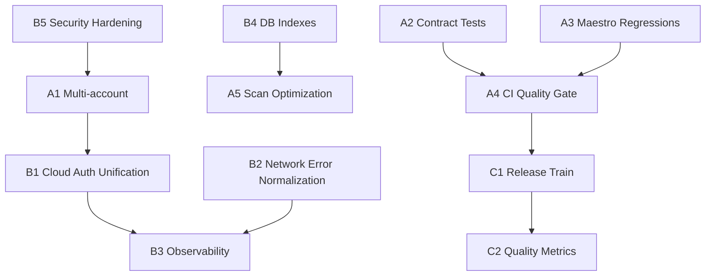

# Стратегический план развития FastMediaSorter

## Назначение документа

Единый мастер-план, связывающий инициативы, технические задания и критерии готовности. Документ фиксирует **что делаем**, **в каком порядке**, **какие зависимости**, **какие артефакты должны быть получены**.

---

## Портфель инициатив

### Категория A — Топ-улучшения (ROI)

| ID | Инициатива | Приоритет | ТЗ |
|----|------------|-----------|----|
| A1 | Multi-account OneDrive / Google Drive | 🔴 Критический | [TZ_A1](TZ_A1_MULTI_ACCOUNT.md) |
| A2 | Контрактные тесты ResourceEditor | 🟡 Высокий | [TZ_A2](TZ_A2_CONTRACT_TESTS.md) |
| A3 | UI-регрессии Maestro | 🔴 Критический | [TZ_A3](TZ_A3_MAESTRO_REGRESSIONS.md) |
| A4 | CI Quality Gate | 🔴 Критический | [TZ_A4](TZ_A4_CI_QUALITY_GATE.md) |
| A5 | Оптимизация сканирования | 🟡 Высокий | [TZ_A5](TZ_A5_SCAN_OPTIMIZATION.md) |

### Категория B — Технический долг

| ID | Инициатива | Приоритет | ТЗ |
|----|------------|-----------|----|
| B1 | Унификация cloud auth flow | 🟡 Высокий | [TZ_B1](TZ_B1_CLOUD_AUTH_UNIFICATION.md) |
| B2 | Нормализация ошибок сети | 🟡 Средний | [TZ_B2](TZ_B2_NETWORK_ERROR_NORMALIZATION.md) |
| B3 | Наблюдаемость (structured logging) | 🟡 Средний | [TZ_B3](TZ_B3_OBSERVABILITY.md) |
| B4 | Оптимизация индексов БД | 🟢 Средний | [TZ_B4](TZ_B4_DB_INDEXES.md) |
| B5 | Подтягивание безопасности | 🟡 Высокий | [TZ_B5](TZ_B5_SECURITY_HARDENING.md) |

### Категория C — Организационный уровень

| ID | Инициатива | Приоритет | ТЗ |
|----|------------|-----------|----|
| C1 | Регламент выпуска (Release Train) | 🟡 Высокий | [TZ_C1](TZ_C1_RELEASE_TRAIN.md) |
| C2 | Метрики качества | 🟡 Средний | [TZ_C2](TZ_C2_QUALITY_METRICS.md) |

---

## Логика зависимостей

---

## Рекомендуемый порядок реализации

1. **A1 + A4** (параллельный запуск ключевой функциональности и качества поставки).
2. **A3** (критические UI-регрессии, чтобы стабилизировать пользовательские сценарии).
3. **A2 + A5** (контрактная защита формы и ускорение сканирования).
4. **B1 → B2 → B3 → B4 → B5** (последовательная техстабилизация с учётом зависимостей).
5. **C1 → C2** (закрепление процесса выпуска и измеримость качества).

---

## Definition of Done (программный уровень)

### Общие критерии для каждой инициативы

- [ ] Все задачи из соответствующего ТЗ закрыты и подтверждены артефактами.
- [ ] Реализованы тесты указанного в ТЗ уровня (unit/integration/UI).
- [ ] Изменения включены в CI и не нарушают обязательные проверки.
- [ ] Обновлены релевантные документы в `dev/` и `docs/`.

### Целевые продуктовые KPI

| KPI | Целевое состояние |
|-----|-------------------|
| Crash-free rate | ≥ 99.5% |
| Median scan time | Снижение не менее чем на 30% от baseline |
| Auth success rate | ≥ 95% |
| Resource save success | ≥ 98% |
| CI pipeline pass rate | ≥ 90% |
| Maestro regression coverage | ≥ 15 критических сценариев |

---

## Матрица трассировки «инициатива → артефакт»

| ID | Ключевые артефакты |
|----|---------------------|
| A1 | Миграция credentials, account picker, auth unit tests, maestro smoke |
| A2 | Набор контрактных тестов ResourceEditor + интеграция в CI |
| A3 | Набор Maestro flow-файлов + CI artifacts (screenshots/logs) |
| A4 | CI workflow + branch protection + quality gate policy |
| A5 | Delta-scan logic, metadata cache entity/DAO, benchmark report |
| B1 | CloudAuthStateMachine, AuthProvider implementations, unified auth entry |
| B2 | NetworkError classifier, retry engine, unified user-facing errors |
| B3 | Structured logger, correlation context, log export |
| B4 | Индексы Room + миграция + EXPLAIN-отчёт |
| B5 | Revocation flow, auditor, orphan cleanup job, secret audit |
| C1 | Release checklist template, changelog/version automation |
| C2 | Metrics instrumentation + автоматический отчёт по KPI |
