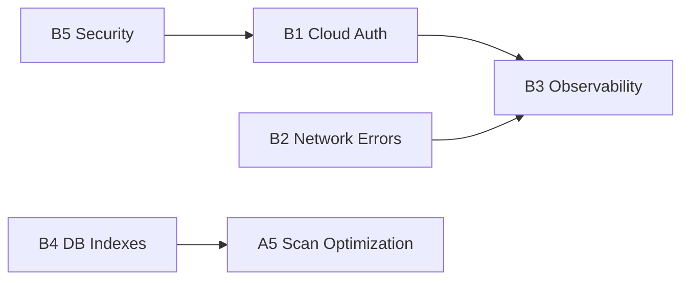

# Тактический план: Категория B — Технический долг

## Охват

Документ декомпозирует инициативы `B1`, `B2`, `B3`, `B4`, `B5` до уровня конкретных задач для исполнения и контроля.

---

## Последовательность работ

1. `B5` Security baseline (ревокация/аудит/чистка).
2. `B1` Унификация cloud auth поверх стабилизированной security-модели.
3. `B2` Нормализация network errors и retry-поведения.
4. `B3` Наблюдаемость на едином auth/error фундаменте.
5. `B4` DB индексы и верификация query plan (выполняется независимо, синхронизируется перед A5).

---

## Task Backlog (готово к постановке)

| Task ID | Инициатива | Задача | Входы | Выходы |
|---------|------------|--------|-------|--------|
| B5-T1 | B5 | Реализовать `revokeToken()` для всех провайдеров | Cloud auth clients | Унифицированная ревокация |
| B5-T2 | B5 | Добавить pending revocation queue для offline кейсов | Storage + worker infra | Надёжная доставка revoke |
| B5-T3 | B5 | Реализовать `CredentialAuditor` на старте приложения | Credential store | Пометка expired credentials |
| B5-T4 | B5 | Реализовать `OrphanCleanupJob` (cache/credentials/destination) | Room tables | Чистая модель данных |
| B5-T5 | B5 | Провести secret hardening и маскирование логов | Build config + logging | Исключение утечек секретов |
| B1-T1 | B1 | Создать `CloudAuthState` и `CloudAuthStateMachine` | Текущие auth flows | State-driven auth orchestration |
| B1-T2 | B1 | Вынести provider-specific auth в `AuthProvider` реализации | Google/OneDrive/Dropbox managers | Сокращение дублирования |
| B1-T3 | B1 | Унифицировать вход в callback/redirect обработку | Activity/DeepLink handling | Единая точка auth callback |
| B1-T4 | B1 | Добавить unit tests на переходы state machine | State graph | Полное покрытие переходов |
| B2-T1 | B2 | Ввести `NetworkError` + `NetworkErrorClassifier` | Network exception map | Единая классификация ошибок |
| B2-T2 | B2 | Реализовать `RetryPolicy` и `withRetry` | Classifier | Контролируемый retry engine |
| B2-T3 | B2 | Увязать ошибки с локализованными user-facing сообщениями | String resources | Понятные сообщения без stack trace |
| B2-T4 | B2 | Заменить разрозненные try/catch в клиентах | SMB/SFTP/FTP/Cloud modules | Консистентная error handling модель |
| B3-T1 | B3 | Реализовать `StructuredLogger` + `CorrelationContext` | Timber/log infra | Сквозной correlation id |
| B3-T2 | B3 | Инструментировать auth/resource/scan/file-ops сценарии | Core flows | Сквозные трассировки |
| B3-T3 | B3 | Реализовать rolling log export в Debug Settings | Debug UI | Экспортируемые диагностические логи |
| B4-T1 | B4 | Выполнить анализ DAO и `EXPLAIN QUERY PLAN` | DAO queries | Карта узких мест |
| B4-T2 | B4 | Добавить/актуализировать индексы в Entity + миграции | Room schema | Оптимизированные query paths |
| B4-T3 | B4 | Подтвердить эффект индексов и отсутствие дубликатов | Benchmark + EXPLAIN | Верифицированная оптимизация |

---

## Контроль полноты

- [ ] Для каждой инициативы `B*` есть кодовые изменения, тесты и документация.
- [ ] `B1/B2/B3` согласованы по контрактам ошибок и логирования.
- [ ] `B4` подтверждён `EXPLAIN QUERY PLAN` до/после.
- [ ] `B5` подтверждён аудитом секретов и отсутствием токенов в логах.

---

## Карта зависимостей

