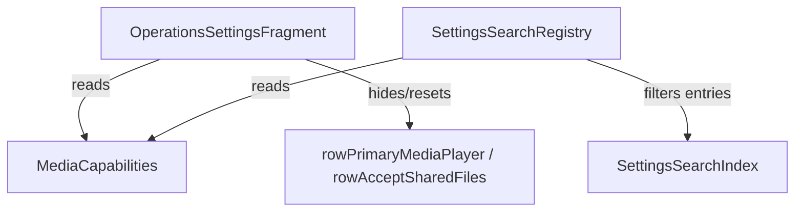

# DESIGN SOLUTIONS (Дизайн решения): S0602 - default-player-toggles-nonfunctional-unsupported-flavors

**Билет:** S0602  
**Название:** default-player-toggles-nonfunctional-unsupported-flavors  
**Дата:** 2026-06-21  

---

## 1. Архитектура решения

Решение состоит из двух частей: скрытие и сброс настроек во фрагменте настроек операций при отсутствии поддержки дефолтного плеера, а также фильтрация поискового индекса настроек на уровне реестра поиска.

### Скрытие и сброс настроек в `OperationsSettingsFragment.kt`
В методе `applyFlavorRestrictions()` мы проверяем значение `mediaCapabilities.supportsDefaultPlayer`. Если поддержка отсутствует:
1. Скрываем `rowPrimaryMediaPlayer` и `rowAcceptSharedFiles` (`isVisible = false`).
2. Скрываем контейнер `layoutDefaultPlayerToggles` (`isVisible = false`).
3. Сбрасываем `isPrimaryMediaPlayer` и `acceptSharedFiles` в `false` в `settings` и обновляем через `viewModel.updateSettings()`.

### Фильтрация поиска в `SettingsSearchRegistry.kt`
Мы добавляем зависимость `MediaCapabilities` в конструктор класса `SettingsSearchRegistry`.
В геттере `entries` мы дополняем фильтр функцией проверки соответствия ключа настройки текущим возможностям:
```kotlin
    val entries: List<SettingsSearchIndex>
        get() = allEntries.filter { entry ->
            availability.isAvailable(entry.sectionId) &&
                isCapabilityAvailable(entry.key)
        }

    private fun isCapabilityAvailable(key: String): Boolean = when (key) {
        "rowPrimaryMediaPlayer", "rowAcceptSharedFiles" -> mediaCapabilities.supportsDefaultPlayer
        "btnSettingsDefaultPlayerImages" -> mediaCapabilities.supportsDefaultPlayer && mediaCapabilities.supportsImages
        "btnSettingsDefaultPlayerAudio" -> mediaCapabilities.supportsDefaultPlayer && mediaCapabilities.supportsAudio
        "btnSettingsDefaultPlayerVideo" -> mediaCapabilities.supportsDefaultPlayer && mediaCapabilities.supportsVideo
        "btnSettingsDefaultPlayerDocs" -> mediaCapabilities.supportsDefaultPlayer && mediaCapabilities.supportsDocuments
        else -> true
    }
```

## 2. Диаграмма связей


## 3. План верификации (без сборки)
Поскольку запуск сборки Gradle запрещен (NO BUILD), верификация будет проводиться статическим анализом измененного Kotlin-кода и проверкой отсутствия синтаксических ошибок (ручной code review).
