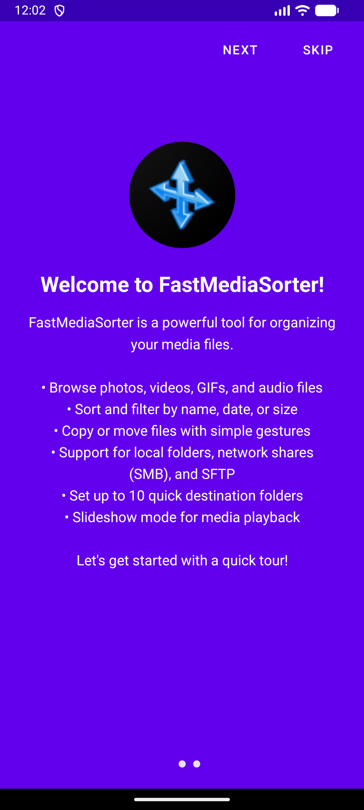
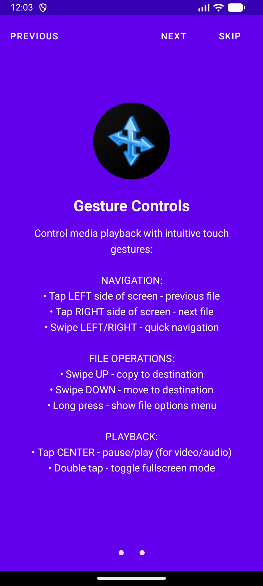
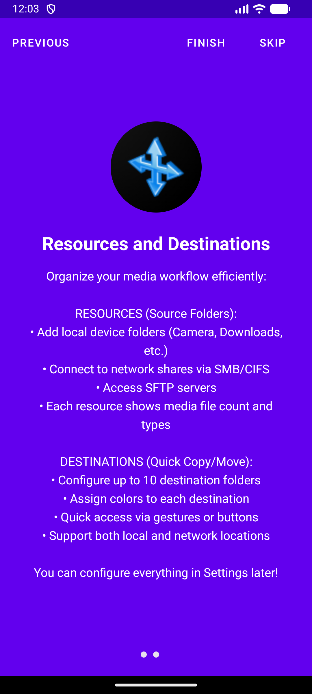
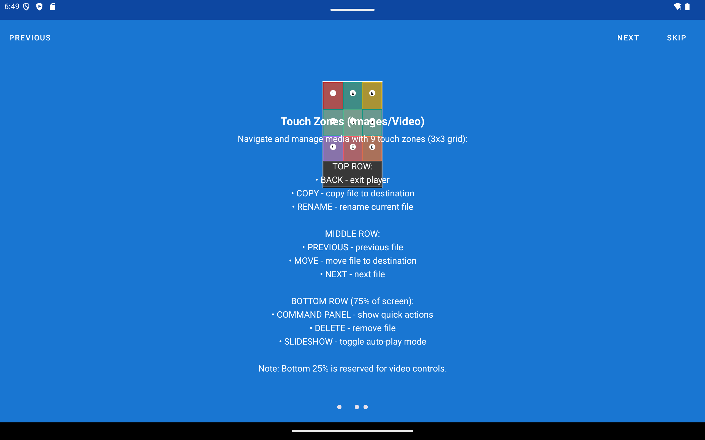

# FastMediaSorter v2 🚀


**📖 Інші мови:** [🇺🇸 English](README.md) | [🇷🇺 Русский](README_RU.md)

**📦 Завантажити:** [](https://apt.izzysoft.de/fdroid/index/apk/com.sza.fastmediasorter)

## Про проект

FastMediaSorter v2 - це потужний Android-додаток для швидкого та зручного сортування медіафайлів (зображень, відео, GIF, аудіо, документів). Він спроектований як єдиний центр для керування файлами з різних джерел: локальні папки пристрою, мережеві диски (SMB, SFTP, FTP) та хмарні сховища (Google Drive, OneDrive, Dropbox).

Ключова ідея v2 - об'єднати перегляд, відтворення та організацію файлів в одному інтуїтивно зрозумілому інтерфейсі, усуваючи недоліки та обмеження попередньої версії. Не вдаватимемо, що v1 була бездоганною - саме тому й з'явилася v2.

## Що замінює FastMediaSorter 🧩

FastMediaSorter - це універсальний медіабраузер, переглядач, плеєр та органайзер. Один застосунок покриває те, для чого зазвичай потрібен десяток окремих програм. Відомі застосунки нижче наведені лише як впізнавані орієнтири для кожної можливості, а не як порівняння.

**Перегляд і відтворення**

- **Відеоплеєр** (MX Player, VLC) - відео, Blu-ray TS/.m2ts, картинка-в-картинці, знімки кадрів, трансляція через Chromecast.
- **Аудіоплеєр** (Poweramp, AIMP) - фонове відтворення, тексти пісень, MIDI, таймер сну, візуалізації, керування зі шторки.
- **Інтернет-радіо / IPTV-плеєр** (TuneIn, Shoutcast, Online Radio, RadioDroid, VLC network streams, IPTV-плеєри) - виділений екран Трансляцій для відтворення інтернет-аудіо та відео: http-радіо, HLS/DASH, RTSP; вбудований мінібанер з ICY-метаданими (назва станції/треку); каталог потоків із пошуком та фільтрами.
- **Галерея / переглядач зображень** (QuickPic, Google Photos) - зображення та GIF, обрізання, фільтри, поворот.
- **Читання PDF / EPUB** (Adobe Reader, Moon+ Reader) - книги, карта розділів, теми, озвучування (TTS).
- **Слайдшоу / фоторамка** - зміна фото з фоновою музикою, плюс віджет фоторамки.
- **ТВ-медіацентр** (Kodi, Nova Video Player) - навігація та відтворення з D-pad, клавіатурою, мишею, геймпадом і пультом ТВ.
- **VR-медіаплеєр** (Pigasus, Skybox VR) - стерео SBS/OU, VR180, 360°, віртуальний кінозал. *(VR-випуск)*

**Зйомка і створення**

- **Камера** (стандартна камера) - фото та відео одразу до вибраної локальної, мережевої або хмарної папки.
- **Диктофон** - голосові нотатки плюс віджет швидкого запису.
- **Редактор малюнків** - полотно, пензлі, фігури, текст, власний колір і розмір пензля.
- **Сканер документів / тексту** (Google Lens, CamScanner) - розпізнавання тексту (OCR) з камери на пристрої з виділенням області.

**Керування файлами**

- **Файловий менеджер** (Total Commander, ES File Explorer, Files by Google) - локальні, мережеві та хмарні файли в одному місці.
- **Клієнт FTP/SFTP/SMB** (AndFTP, Solid Explorer) - мережеві джерела з SSH-ключами та закріпленням ключа хоста.
- **Хмарні клієнти** (Google Drive, Dropbox, OneDrive) - хмарні диски як джерела медіа.
- **Пошук дублікатів** (Duplicate Files Fixer) - трьохетапний рушій: розмір -> хеш -> SHA-256.
- **Кошик** (Dumpster) - м'яке видалення з відновленням одним дотиком.
- **Розпакування архівів** (ZArchiver) - видобування ZIP, зокрема захищених паролем. *(базово)*
- **Менеджер завантажень** (1DM, ADM) - вставте посилання та збережіть одразу до вибраної папки.
- **Планувальник завдань** - файлові операції за розкладом.

**Текст і утиліти**

- **Редактор тексту / Markdown** - редагування `.txt`/`.md` з підсвічуванням синтаксису та автозбереженням.
- **Перекладач** (Google Translate офлайн) - повністю офлайн-переклад.
- **Калькулятор** - вбудований обрахунок виразів з виділеного тексту. *(базово)*
- **Трансляція на ТВ** (Google Home) - Chromecast для відео та аудіо.
- **Набір віджетів робочого столу** - віджети швидкого запуску та стану для диктофона, OCR з камери, завдань за розкладом, поточного треку та фоторамки.
- **Резервна копія налаштувань** - експорт і відновлення налаштувань застосунку, джерел, обраного, розкладів, паролів та входів. *(лише налаштування застосунку)*

> *Чесні застереження: калькулятор та архіватор - базові (обрахунок з тексту / видобування ZIP), а не повноцінна заміна. Резервна копія охоплює налаштування самого застосунку, а не всього пристрою. VR-плеєр доступний лише у VR-випуску.*

## Версія для Windows 🖥️

Шукаєте рішення для настільного комп'ютера? Спробуйте **FastMediaSorter LITE** - легкий додаток Windows Forms для швидкого сортування, перегляду та керування зображеннями та відео:

🔗 **[FastMediaSorter LITE для Windows](https://github.com/SerZhyAle/FastMediaSorter_Lite)**

Особливості:

- Швидка навігація по великих папках із зображеннями та відео
- Режими слайд-шоу та випадкового перегляду
- Відстеження останніх файлів та папок
- Операції з файлами: переміщення, копіювання, перейменування та видалення
- Панель зображень для швидкої візуальної навігації
- Налаштовувані комбінації клавіш для ефективної роботи
- Багатомовна підтримка (Англійська/Російська)
- Підтримка Windows 7/10/11 з .NET Framework 4.8

## Зміст

- [Завантажити](#завантажити-)
- [Версії додатку](#версії-додатку-flavors-)
- [Ключові можливості](#ключові-можливості)
- [Підтримувані медіаформати](#підтримувані-медіаформати-)
- [Скріншоти](#скріншоти-)
- [Сценарії використання](#сценарії-використання-)
- [Документація](#документація-)
- [Wear OS Companion](#wear-os-companion-)
- [Інструкція зі збирання](#інструкція-зі-збирання)
- [Тестування](#тестування-)
- [Перші кроки](#перші-кроки-короткий-посібник-)
- [Технологічний стек](#технологічний-стек)

## Версії додатку (Flavors) 🎯

FastMediaSorter v2 доступний у **5 основних варіантах додатку** для телефонів, планшетів і XR-сценаріїв. Актуальна публічна матриця зафіксована в [FEATURES_UK.md](FEATURES_UK.md) та [HOW_TO_UK.md](HOW_TO_UK.md):

| Версія | Опис | Примітки |
|--------|------|----------|
| **Standard** | Повнофункціональний реліз | Найширший набір можливостей для медіа, документів, OCR, перекладу та хмарних інтеграцій |
| **Lite** | Полегшений реліз | Менший розмір, базові медіасценарії, Трансляції лише для прогресивного аудіо (без HLS/DASH/RTSP) |
| **Photos** | Фото-орієнтований реліз | Тільки зображення; Трансляції недоступні |
| **Legacy** | Реліз для сумісності | Повний медіафункціонал з SMB/FTP/SFTP і хмарою (Google Drive, Dropbox, OneDrive); зібраний для Android 6/7 (API 23+) |
| **VR / noLegal** | XR і sideload-збірка | OpenXR / VR-capable шлях для сумісних шоломів і sideload-only можливості |

### Яку версію вибрати?

- **Standard** ⭐ **(Рекомендується)**: Найкращий вибір за замовчуванням для більшості користувачів
- **Lite**: Підійде, якщо потрібен легший пакет і простіше налаштування
- **Photos**: Найкращий вибір для фото-орієнтованих сценаріїв
- **Legacy**: Обирайте для пристроїв на Android 6/7 (API 23+) - включає мережу і хмару
- **VR / noLegal**: Використовуйте лише якщо вам потрібна XR-збірка для шолома або sideload-only surface

Для точної матриці можливостей за версіями використовуйте канонічні документи:

- [Каталог можливостей (канонічний)](FEATURES_UK.md)
- [How-To (таблиця доступності за версіями)](HOW_TO_UK.md)
- [Quick Start (вибір версії)](QUICK_START_UK.md)
- [Обмеження програми](LIMITATIONS_UK.md)

> 🧭 **Перший запуск:** прямо під вибором мови додаток запропонує вибрати **профіль пристрою** (телефон, планшет, ТВ, авто, фоторамка, VR та інші), який підбере для вас стартові налаштування - змінити можна будь-коли в Налаштуваннях. Див. [Перший запуск: виберіть профіль пристрою](QUICK_START_UK.md#перший-запуск-виберіть-профіль-пристрою-30-секунд-).

## Завантажити 📥

📲 **[Завантажити з Google Play](https://play.google.com/store/apps/details?id=com.sza.fastmediasorter)**

<a href="https://github-store.org/app?repo=SerZhyAle/FastMediaSorter_mob_v2">
  
</a>

Доступно в GitHub Store - встановлення та оновлення безпосередньо з релізів на GitHub.

**Скомпільовані APK файли НЕ зберігаються в цьому GitHub репозиторії.** Всі збірки доступні в **Google Drive**:

🔗 **[Завантажити всі збірки з Google Drive](https://drive.google.com/drive/folders/1_U47It406WWQKaXkGGzNVPcKE4OPV0Jp?usp=sharing)**

| Версія | Ім'я файлу | Опис |
|--------|------------|------|
| **Standard** | `FastMediaSorter_standard_release.zip` | Повний функціонал (Хмара, OCR, EPUB) |
| **Lite** | `FastMediaSorter_lite_release.zip` | Базова (Без хмари/аудіо) |
| **Photos** | `FastMediaSorter_photos_release.zip` | Тільки зображення |
| **Legacy** | `FastMediaSorter_legacy_release.zip` | Медіа + мережа (SMB/FTP/SFTP) + хмара; Android 6/7 (API 23+) |

> **Примітка**: Всі збірки автоматично завантажуються в Google Drive після успішної компіляції.
>
> 🔐 **Пароль від ZIP: `1`** (APK упаковані в захищені паролем архіви для обходу обмежень Google Drive)

## Скріншоти 📱

| Main Screen | File Actions | Settings |
|:-----------:|:------------:|:--------:|
| <a href="images/Screenshot_20251109_000251.png"></a> | <a href="images/Screenshot_20251109_000314.png"></a> | <a href="images/Screenshot_20251109_000323.png"></a> |
| **Player View** | | |
| <a href="images/Screenshot_20251114_184930.png"></a> | | |

Зображення у повному розмірі:

- [Main Screen](images/Screenshot_20251109_000251.png)
- [File Actions](images/Screenshot_20251109_000314.png)
- [Settings](images/Screenshot_20251109_000323.png)
- [Player View](images/Screenshot_20251114_184930.png)

## Ключові можливості

- 🗂️ **Єдиний інтерфейс:** Перегляд та керування файлами з усіх джерел в одному вікні.
- ⚡ **Швидке сортування:** Копіюйте або переміщуйте файли до заздалегідь налаштованих папок-отримувачів одним натисканням.
- ⭐ **Система вибраного:** Позначайте важливі файли як вибрані та швидко отримуйте доступ до них зі спеціальної вкладки, яка агрегує вибране з усіх джерел.
- 🔒 **Захист PIN-кодом:** Захистіть окремі ресурси PIN-кодами доступу, щоб запобігти несанкціонованому перегляду та редагуванню.
- ⚙️ **Налаштування ресурсів:** Налаштовуйте інтервал слайд-шоу, глибину сканування (підпапки) та створення мініатюр для кожної папки індивідуально.
- 🧭 **Профіль пристрою:** При першому запуску виберіть профіль для телефона, планшета, TV/медіабокса, автомагнітоли, медіаплеєра, фоторамки, аудіоплеєра, електронної книги, VR-шолома або ручних налаштувань; застосунок використає відповідні стартові значення безпеки, екрана, контенту та пріоритетів команд.
- 📋 **Передвизначені розумні ресурси:** Вбудовані віртуальні ресурси - **Вся музика**, **Всі відео**, **Всі фото** - агрегують медіафайли з усього пристрою без додаткового налаштування. Миттєвий доступ до повної медіатеки без ручного додавання папок.
- 🖥️ **Підтримка мережі та хмари:** Працюйте з файлами на ваших мережевих дисках (SMB), SFTP-серверах, FTP та у хмарних сховищах (Google Drive, OneDrive, Dropbox).
- 🖼️ **Гнучкий перегляд:** Відображення файлів у вигляді сітки, що налаштовується, або детального списку з підтримкою пагінації для великих колекцій (1000+ файлів).
- ▶️ **Вбудований плеєр:** Відтворення відео та аудіо, перегляд зображень та GIF без виходу з програми. Підтримує слайд-шоу та масштабування.
- 🧩 **Інтеграція як плеєра за замовчуванням:** Через опційні перемикачі відтворення FastMediaSorter може працювати системним обробником інтенів відкриття/шерінгу (ACTION_VIEW / ACTION_SEND), а також приймати пробудження аудіосервісу від апаратних медіа-кнопок.
- 🎛️ **Підтримка апаратних кнопок:** Кнопки керування на кермі, кнопки гарнітури та фізичні медіа-клавіші (Play/Pause, Next, Previous) повністю підтримуються через фоновий аудіосервіс - без необхідності торкатися екрана.
- 🎵 **Текст пісень (Лірика):** Перегляд тексту поточної пісні. Автоматичний пошук за метаданими (Виконавець/Назва) через `api.lyrics.ovh` із запасним варіантом пошуку за іменем файлу.
- ✏️ **Редагування зображень:** Поворот, віддзеркалення, фільтри (відтінки сірого, сепія, негатив), налаштування яскравості/контрасту/насиченості - як для локальних, так і для мережевих файлів.
- ⌨️ **Підтримка клавіатури та миші:** Повна навігація з клавіатури (стрілки, гарячі клавіші Ctrl+A/C/X, F2, F5, Delete, Backspace) та підтримка миші (контекстне меню по правій кнопці, hover-ефекти, індикатори фокусу) для ChromeOS та desktop-режиму.
- 🔍 **Сортування та фільтрація:** Впорядковуйте файли за іменем, датою, розміром та тривалістю. Застосовуйте фільтри для швидкого пошуку.
- ↩️ **Скасування та Кошик:** Можливість скасувати останню дію (копіювання, переміщення, видалення) з функцією soft-delete до папки `.trash/`. Включає функцію "Очистити кошик" для ресурсів.
- 🎨 **Сучасний інтерфейс:** Підтримка світлої та темної тем, інтуїтивно зрозуміле керування, Material Design 3.
- 💾 **Розумне кешування:** Двоетапне завантаження метаданих відео (1МБ початкова, 5МБ розширена) та налаштовуваний кеш мініатюр (2ГБ за замовчуванням, до 16ГБ).
- 📄 **Перегляд документів:** Вбудований переглядач для текстових файлів (.txt, .md, .log, .json, .xml) та PDF документів з підтримкою масштабування, переміщення та навігації жестами.
- 📚 **Читалка EPUB:** Вбудована читалка електронних книг з навігацією по розділах, змістом, регулюванням розміру шрифту, пошуком по тексту та підтримкою світлої/темної теми. Працює з локальними та мережевими файлами.
- 🌐 **Авто-переклад:** Миттєвий переклад тексту із зображень, PDF і текстових файлів за допомогою **Гібридної системи OCR** (Google ML Kit + Tesseract) для високої точності як латиниці, так і кирилиці.
- 📱 **Підтримка віджетів:** Понад десяток віджетів для домашнього екрана - ярлики ресурсів, медіаплеєри, захоплення з камери, калькулятор, заплановані завдання, вибране, міні-ігри та багато іншого. Повний вибір доступний у пікері віджетів вашого лаунчера.
- ⏰ **Заплановані операції:** Автоматизуйте керування файлами за розкладом. Налаштуйте повторювані операції Копіювання, Переміщення або Видалення між будь-якими ресурсами (локальні, мережа, хмара) з фільтрами за типом файлів та часом. Операції виконуються у фоні через WorkManager навіть коли застосунок закрито.
- 👆 **Продвинуті жести:** Розумне масштабування зображень (2x/3x/4x) та інтуїтивні сенсорні зони для навігації файлами.
- 📸 **Зберегти кадр:** Знімок поточного кадру відео у PNG або JPG, зберігається у будь-який налаштований ресурс - локальний або мережевий. Формат і ресурс призначення задаються у Video Settings.
- 🖨️ **Друк:** Відправлення документів (PDF, TXT) і зображень на принтер прямо з вбудованого плеєра. Мережеві та хмарні файли попередньо кешуються.
- ⬇️ **Stream Offload:** Завантаження мережевого файлу у локальний кеш із діалогом прогресу перед відтворенням або під час нього. Після закінчення пропонується очистити кеш.
- 🔊 **DTS/DTS-HD аудіо:** Треки DTS і DTS-HD декодуються програмно через кастомну збірку FFmpeg - спеціального обладнання не потрібно.
- 🎨 **Колір і яскравість відео:** Регулювання відтінку (Hue) та яскравості (Brightness) у реальному часі через Media3 GPU-ефекти. Налаштування зберігаються між відеофайлами.
- 📤 **Поділитися у FastMediaSorter:** Приймання файлів з будь-якого застосунку через стандартний механізм «Поділитися» Android з наступним копіюванням у вибраний ресурс одним натисканням.
- 📻 **Трансляції (Інтернет-радіо та потокове відео):** Виділений екран для http(s)-радіо, HLS/DASH VOD та RTSP-джерел. Додавайте URL вручну або імпортуйте .m3u-плейлист / кураторський каталог. Вбудоване програвання аудіо безпосередньо зі списку з липким міні-баннером ICY now-playing. Фільтрація за категорією та мовою. Підтримується в Standard, Legacy, Lite (лише аудіо); відсутнє у Photos.

## Підтримувані медіаформати 🎞️

FastMediaSorter v2 підтримує широкий спектр форматів:

- **Зображення:** JPG, JPEG, PNG, GIF, BMP, WEBP, HEIC, HEIF, AVIF
- **Відео:** MP4, MKV, MOV, WMV, FLV, WEBM, M4V, 3GP, MPG, MPEG, TS, M2TS, VOB, OGV, DIVX, MTS
- **Аудіо:** MP3, FLAC, AAC, OGG, M4A, WMA, OPUS, AMR, ALAC, CAF, MKA, OGA, AC3, MID, MIDI, DTS, DTS-HD
- **Потоки:** HTTP(S) прогресивне аудіо (MP3/AAC), Icecast/Shoutcast ICY, HLS (.m3u8), DASH, RTSP; .m3u плейлисти (Standard/Legacy); лише прогресивне аудіо у Lite; недоступно у Photos.
- **Документи:** TXT, MD, LOG, JSON, XML, PDF, **EPUB**
- **Бінарні файли** (Режим файлового менеджера): ZIP, RAR, 7z, TAR, GZ, ISO, DMG, IMG, APK, EXE, DLL, SO та 60+ інших форматів

## Сценарії використання 💡

Ось кілька способів, як FastMediaSorter v2 може вам допомогти:

### 1. 📸 Організація фотографій з камери

Підключіть телефон або відкрийте локальну папку з камерою. Налаштуйте папку призначення "Найкращі фото". Відкрийте перегляд, швидко прогортайте тисячі фотографій та натискайте кнопку призначення, щоб миттєво копіювати найкращі знімки.

### 2. 🏠 Мережеве резервне копіювання (NAS)

Додайте ваш домашній NAS через SMB. Переглядайте локальні медіафайли. Виберіть кілька файлів або діапазон і перемістіть ("Move") їх на NAS для збереження, звільняючи місце на пристрої.

### 3. ☁️ Керування хмарою

Підключіть обліковий запис Google Drive, OneDrive або Dropbox. Переглядайте хмарні файли без їх повного завантаження. Видаляйте непотрібні файли або організовуйте їх по папках прямо у хмарі.

### 4. 📺 Слайд-шоу та презентація

Відкрийте папку з сімейними фото або слайдами презентації. Натисніть "Play", щоб запустити слайд-шоу. Використовуйте налаштування ресурсу, щоб відрегулювати тривалість показу слайдів.

### 5. ⭐ Управління обраним

Відмічайте важливі файли кнопкою "зірка" під час перегляду. Пізніше перейдіть на вкладку "Обране" в головному меню, щоб миттєво отримати доступ до всіх обраних файлів з усіх джерел в одному місці - ідеально для створення кураторської колекції найкращих медіа.

### 6. 🎶 Слайд-шоу з фоновою музикою

Додайте вашу музичну колекцію як ресурс. У Налаштуваннях → Аудіо увімкніть "Фонова музика для слайд-шоу" та виберіть ваш музичний ресурс. Тепер при запуску слайд-шоу ваших фотографій ваші улюблені треки гратимуть на фоні. Натисніть на назву треку, щоб переключитися на іншу випадкову пісню, створюючи ідеальну атмосферу для ваших фото-презентацій.

### 7. 🖼️ Цифрова Фоторамка на Планшеті

Перетворіть будь-який Android-**планшет** на красиву завжди ввімкнену цифрову фоторамку. Поставте його на підставку, підключіть до домашнього ПК (SMB) або хмари - фотографії транслюються напряму без зайняття локальної пам'яті. Налаштуйте інтервал зміни слайдів, увімкніть постійно активний екран, додайте фонову музику та насолоджуйтесь спогадами. Навіть старі бюджетні планшети чудово підходять для цієї мети - додаток оптимізований для тривалого відтворення з мінімальним навантаженням.

### 8. 🍿 Домашній Кінотеатр та VR

Дивіться серіали з комп'ютера або хмари прямо на телефоні чи у VR-шоломі. Не треба чекати копіювання або хвилюватися за вільне місце. Просто натисніть "Play" - наступна серія почнеться автоматично.

**Сценарії для VR-шолома** - FastMediaSorter запускається нативно на Android-шоломах (Meta Quest, Pico та аналогах) без жодних модифікацій:

- **🎬 Гігантський віртуальний кінотеатр**: Відкрийте відео з домашнього NAS або хмари та дивіться його на віртуальному екрані розміром зі стіну. Не потрібно копіювати гігабайтні файли на шолом - додаток стримить напряму по домашній мережі. Коли одна серія закінчується, наступна запускається автоматично.
- **🎵 Іммерсивний музичний плеєр**: Запустіть свою музичну колекцію у VR-середовищі. Фоновий аудіосервіс продовжує відтворення навіть при переключенні між додатками або відкритті головного екрана шолома. Апаратні кнопки шолома (відтворення/пауза, наступний трек) працюють без торкання контролера.
- **🖼️ Фоторамка розміром зі стіну у VR**: Перетворіть VR-шолом на іммерсивний фотодосвід - запустіть слайд-шоу, і ваші фотографії заповнять величезну віртуальну стіну навколо вас. Додайте фонову музику для кінематографічного занурення у спогади. Стримте фото напряму з домашнього ПК або хмари - пам'ять шолома залишається вільною.

### 9. 🧹 Порядок у Завантаженнях

Папка "Downloads" переповнена? Відкрийте її як джерело, налаштуйте кнопки призначення для "Документів", "Зображень" та "APK". Швидко переглядайте файли та розкладайте їх по папках одним дотиком. Ви можете наводити лад навіть на віддаленому комп'ютері, використовуючи телефон як пульт керування.

### 10. 🚗 Музика в Автомобілі на Android-Магнітолі

Встановіть FastMediaSorter на автомобільну Android-магнітолу або головний пристрій. Додайте папки з музикою з USB-накопичувача або SD-карти - або скористайтеся вбудованим віртуальним ресурсом **Вся музика** для миттєвого доступу до всієї колекції без додаткового налаштування. Апаратні кнопки керування (кнопки на кермі, регулятори) працюють напряму через фоновий аудіосервіс: відтворення/пауза, наступний/попередній трек - без необхідності дивитися на екран. Додаток запам'ятовує позицію відтворення та автоматично відновлює її при запуску.

> **Інтернет-радіо на магнітолі:** Відкрийте **Трансляції** (пункт меню або Налаштування → Медіа → Трансляції) і додайте URL вашої інтернет-радіостанції або імпортуйте .m3u-плейлист. Аудіо програється безпосередньо зі списку, керування кнопками керма працює без торкання екрана. Потребує підключення до мобільного інтернету або Wi-Fi точки доступу.

### 11. 📺 Медіацентр на Android TV-приставці

Встановіть FastMediaSorter на будь-яку Android TV-приставку (Xiaomi Mi Box, Nvidia Shield, Amazon Fire TV або дженерик Android-бокс). Підключіться до домашнього NAS через SMB, додайте Google Drive або Dropbox, або підключіть USB-накопичувач - усе в одному додатку. Керуйте повністю з пульта ДК або Bluetooth-клавіатури: D-pad переміщує фокус, **OK** відкриває елементи, **Back** повертає на рівень вище, **Backspace** піднімається на папку вгору в браузері файлів. Кольорові кнопки пульта призначені на найчастіші операції з файлами (**Червона** = Видалити, **Зелена** = Копіювати, **Жовта** = Перемістити, **Синя** = Перейменувати). Запустіть слайд-шоу з фоновою музикою на весь екран телевізора або увімкніть аудіо з відображенням обкладинок альбомів та текстів пісень. Тачскрін не потрібен жодного кроку.

## Документація 📚

**🗺️ Карта документації:** [Усі документи](DOCS_MAP.md)

**🌐 Офіційний сайт:** [https://serzhyale.github.io/FastMediaSorter_mob_v2/](https://serzhyale.github.io/FastMediaSorter_mob_v2/)

### Канонічні джерела (Single Source of Truth)

Наступні файли є джерелом істини для користувацької документації:

- [Повний перелік можливостей](FEATURES.md)
- [Карта документації](DOCS_MAP.md)
- [Завантаження збірок (EN)](DOWNLOADS_EN.md)
- [How-To Guides](HOW_TO.md)
- [Обмеження програми](LIMITATIONS.md)
- [Швидкий старт](QUICK_START.md)
- [Умови використання](TERMS_OF_SERVICE.md)

Детальні керівництва доступні кількома мовами:

**🇺🇦 Українська:**

- [Посібники](HOW_TO_UK.md)
- [Швидкий Старт](QUICK_START_UK.md)
- [FAQ](FAQ_UK.md)
- [Вирішення проблем](TROUBLESHOOTING_UK.md)
- [Обмеження програми](LIMITATIONS_UK.md)
- [Завантаження збірок](DOWNLOADS_UK.md)

**🇺🇸 English:**

- [How-To Guides](HOW_TO.md)
- [Quick Start](QUICK_START.md)
- [FAQ](FAQ.md)
- [Troubleshooting](TROUBLESHOOTING.md)
- [Program Limitations](LIMITATIONS.md)
- [Downloads Guide](DOWNLOADS_EN.md)
- [Complete Feature List](FEATURES.md)
- [Module Selection Guide](MODULE_SELECTION.md)

**🇷🇺 Русский:**

- [Руководства](HOW_TO_RU.md)
- [Быстрый Старт](QUICK_START_RU.md)
- [FAQ](FAQ_RU.md)
- [Устранение неполадок](TROUBLESHOOTING_RU.md)
- [Ограничения программы](LIMITATIONS_RU.md)
- [Скачивание сборок](DOWNLOADS_RU.md)

**Technical / Developer Docs:**

- [Architecture Overview](ARCHITECTURE.md)
- [DevOps & Build Scripts](DEV_OPS.md)
- [Technology Stack](TECH_STACK.md)
- [Wear OS Documentation](WEAR_OS_QUICK_START.md)
- [Open Source Components](OPEN_SOURCE.md)

## Wear OS Companion ⌚

FastMediaSorter має companion-додаток для Wear OS, оптимізований під сценарії використання на смарт-годинниках.

- Перегляд і відтворення локальних медіа безпосередньо на Wear OS-пристроях
- UI та поведінка рантайму оптимізовані для компактних екранів круглої форми
- Окрема документація з інсталяції, збирання та налагодження Wear-сценаріїв

Документація Wear OS:

- [Wear OS Quick Start](WEAR_OS_QUICK_START.md)
- [Wear OS Setup](WEAR_OS_SETUP.md)
- [Wear OS Status](WEAR_OS_STATUS.md)
- [Розділ Wear OS у FEATURES](FEATURES.md#16-settings--navigation)

## Інструкція зі збирання

### Вимоги

- Android Studio Hedgehog (2023.1.1) або новіше

- JDK 17+
- Android SDK 35
- Мінімальна версія Android: 8.0 (API 26) для Standard/Lite/Photos; 6.0 (API 23) для Legacy

### Збирання

1. Клонуйте репозиторій:

    ```bash
    git clone https://github.com/SerZhyAle/FastMediaSorter_mob_v2.git
    cd FastMediaSorter_mob_v2
    ```

2. Відкрийте проект в Android Studio.
3. Дочекайтеся закінчення синхронізації Gradle.
4. Запустіть додаток на емуляторі або фізичному пристрої.

### Зібрані APK 📦

Після кожної успішної збірки згенерований файл APK автоматично копіюється в папку `DOWNLOADS` в корені проекту з часовою міткою. Там ви можете знайти всю історію ваших збірок.

### Рекомендовані команди збирання (Windows / PowerShell)

```powershell
.\build-debug.PS1
.\gradlew.bat assembleStandardDebug
.\gradlew.bat testStandardDebugUnitTest
.\gradlew.bat lintStandardDebug
```

## Тестування 🧪

FastMediaSorter v2 використовує **Maestro** для end-to-end тестування.

### Швидкий запуск

```bash
# Windows (PowerShell)
.\maestro\run-tests.ps1 smoke

# Швидкий ярлик
.\scripts\utils\run-maestro-smoke.ps1
```

Документація з тестів:

- [Quick Start Guide](../maestro/QUICK_START.md)
- [Writing Tests](../maestro/WRITING_TESTS.md)
- [Test Examples](../maestro/EXAMPLES.md)
- [Troubleshooting](../maestro/TROUBLESHOOTING.md)
- [Full Documentation](../maestro/README.md)

CI workflow:

- [Maestro Tests Workflow](../.github/workflows/maestro-tests.yml)

## Перші кроки (Короткий посібник) 🚀

1. **Додавання папки (ресурсу):**
    - На головному екрані натисніть кнопку з іконкою "Плюс" (+), щоб додати новий ресурс.
    - Виберіть тип ресурсу (наприклад, "Локальна папка").
    - Використовуйте сканування або додайте папку вручну. Після додавання вона з'явиться у списку на головному екрані.

2. **Перегляд файлів:**
    - Двічі торкніться (або зробіть довге натискання) на доданий ресурс у списку.
    - Відкриється екран перегляду, де ви побачите всі медіафайли з цієї папки у вигляді списку або сітки.
    - Використовуйте кнопки на верхній панелі для сортування, фільтрації або перемикання виду.

3. **Відтворення та сортування:**
    - Натисніть на будь-який файл, щоб відкрити його в повноекранному плеєрі.
    - Використовуйте свайпи вліво/вправо або сенсорні зони для навігації між файлами.
    - Для виконання операцій (копіювання, переміщення) використовуйте відповідні сенсорні зони або кнопки на панелі керування.

4. **Налаштування папок-отримувачів (Destinations):**
    - У налаштуваннях, на вкладці "Destinations", ви можете вказати до 30 папок, які будуть використовуватися для швидкого сортування.
    - Альтернативно, увімкніть опцію "Is Destination" (Є призначенням) у вікні редагування будь-якого ресурсу, щоб додати його до списку швидкого сортування.
    - Після цього на екрані плеєра з'являться кнопки для швидкого копіювання або переміщення файлів у ці папки.

## Технологічний стек

- **Мова**: Kotlin
- **Архітектура**: Clean Architecture, MVVM
- **UI**: Android View System (XML), Material Design 3
- **Асинхронність**: Kotlin Coroutines & Flow
- **DI**: Hilt (Dagger)
- **База даних**: Room 2.7.0
- **OCR та Переклад**: Google ML Kit (Розпізнавання тексту, Переклад), Tesseract4Android (OCR для кирилиці)
- **Навігація**: AndroidX Navigation Component
- **Медіа**: ExoPlayer (Media3 1.2.1)
- **Зображення**: Glide 4.16.0 з кастомним NetworkFileModelLoader
- **Мережеві протоколи**:
  - SMB: SMBJ 0.12.1 з BouncyCastle 1.78.1
  - SFTP: SSHJ 0.37.0 з EdDSA 0.3.0
  - FTP: Apache Commons Net 3.10.0
- **Хмара**: Google Drive API, OneDrive (MSAL), Dropbox API з OAuth 2.0

## Версія збірки

Формат: `Y.YM.MDDH.Hmm` (наприклад, `2.60.1102.207` для 2026/01/10 20:07)

Див. [dev/CHANGELOG.md](../dev/CHANGELOG.md) для детальної історії змін.

## Методологія розробки 🧠

Робочий процес AI-асистованої розробки цього проєкту - дослідження перед дією, розділення стратегічних і тактичних специфікацій, конвеєри slash-команд, постійна пам'ять агента та механічні перевірки на «слоп» - виокремлено в переносний, незалежний від стеку інструментарій:

🔗 **[Universal Agent Kit](https://serzhyale.github.io/universal-agent-kit/)** - невелика «операційна система» поверх AI-асистентів, під ліцензією MIT.

## Contributing 🤝

Pull requests are welcome. For major changes, please open an issue first to discuss what you would like to change.

## Контакти 📧

- **Розробник**: <sza@ukr.net>
- **Сайт**: [https://serzhyale.github.io/FastMediaSorter_mob_v2/](https://serzhyale.github.io/FastMediaSorter_mob_v2/)
- **GitHub Issues**: [https://github.com/SerZhyAle/FastMediaSorter_mob_v2/issues](https://github.com/SerZhyAle/FastMediaSorter_mob_v2/issues)

## Ліцензія 📄

Юридична інформація проєкту:

- [Terms of Service](TERMS_OF_SERVICE.md)
- [Privacy Policy](PRIVACY_POLICY.md)
- [Open Source Components](OPEN_SOURCE.md)
