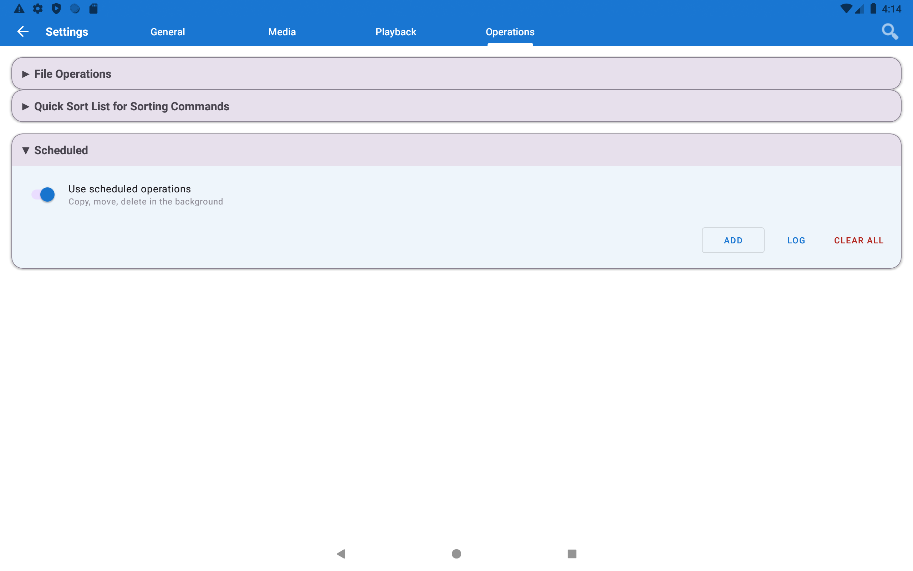
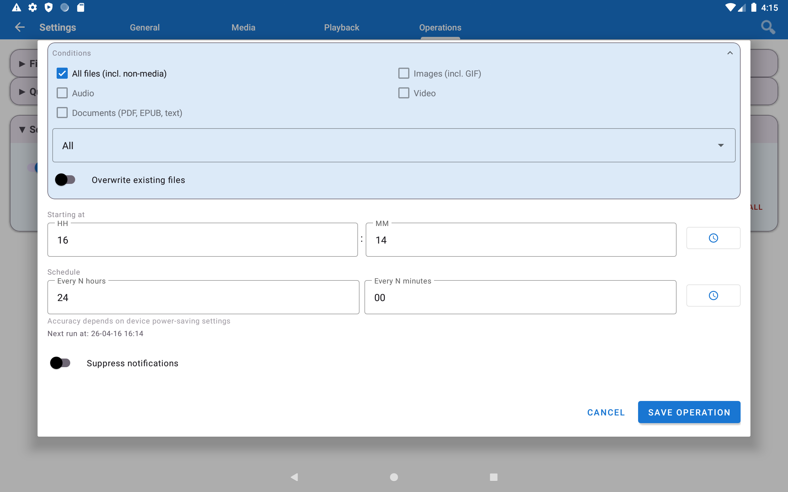
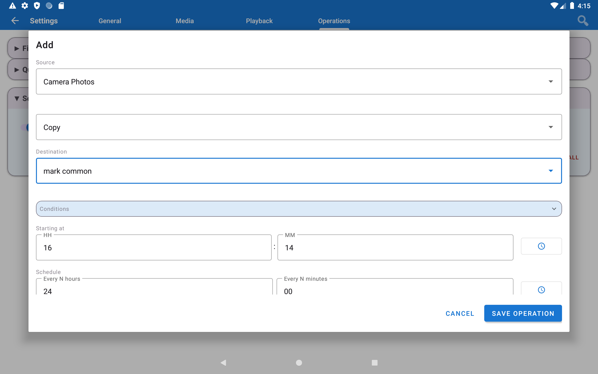
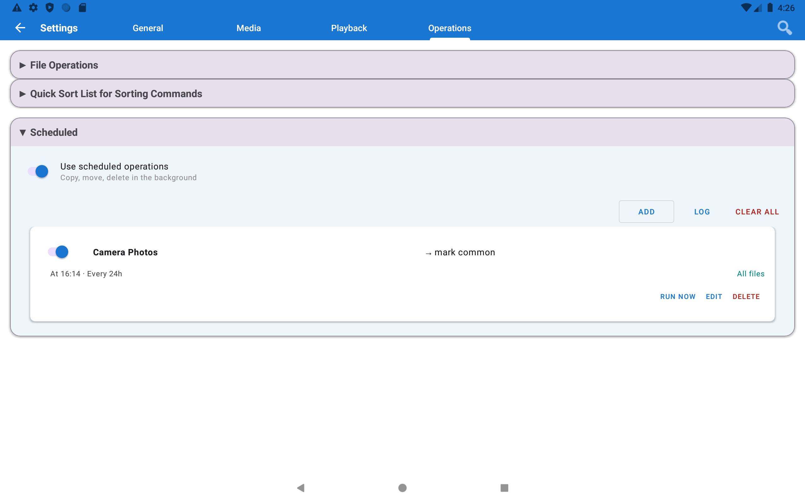

# 📷 Автобекап фото на ПК за розкладом

> **Рівень:** Початківець &bull; **Час:** ~15 хвилин на налаштування &bull; **Версія:** Standard, Photos, Legacy, VR, noLegal (потрібні мережеві джерела - у Lite їх немає)

[English](scenario-camera-backup.md) | [Русский](scenario-camera-backup-ru.md)

Автоматично копіюйте нові фото з камери телефону на домашній комп'ютер **щоночі по Wi-Fi**. Налаштуйте раз - працює вічно без вашої участі.

**Що це дає:** щоранку ви прокидаєтесь, а вчорашні фото вже на ПК. Без кабелів. Без платних хмар. Без забувань. Повністю автоматично.

---

## Що вам знадобиться

- Телефон і ПК підключені до **однієї домашньої Wi-Fi мережі** (одного роутера)
- Папка на ПК, куди зберігатимуться фото (наприклад, `C:\РезервФото`)
- Встановлена версія FastMediaSorter з мережевими джерелами (**Standard**, Photos, Legacy, VR, noLegal)

> **Не знаєте, яка у вас версія?** Відкрийте застосунок → натисніть іконку меню (☰) у верхньому лівому куті. Назва версії (Standard / Lite / тощо) відображається внизу бічного меню.

---

## Крок 1 - Створіть папку для резервних копій на ПК

Спершу створіть папку на ПК, а потім відкрийте до неї мережевий доступ.

На **Windows:**
1. Створіть нову папку будь-де, наприклад `C:\РезервФото`
2. **Права кнопка миші** на папці → **Властивості** → вкладка **Доступ** → кнопка **Надати доступ..**
3. У списку, що з'явиться, виберіть своє ім'я користувача або введіть **Всі** → натисніть **Додати** → **Поділитись**
4. Windows показує мережевий шлях - запишіть його. Він виглядає так: `\\MYPC\РезервФото`

> **Також запишіть IP-адресу вашого ПК** - вона знадобиться на наступному кроці. Швидкий спосіб: натисніть **Win + R**, введіть `cmd`, натисніть Enter. У чорному вікні введіть `ipconfig` і натисніть Enter. Знайдіть рядок **IPv4-адреса** під вашим Wi-Fi адаптером. Приклад: `192.168.1.100`. Запишіть цей номер.

---

## Крок 2 - Підключіть застосунок до папки на ПК

Тепер вкажіть FastMediaSorter, куди надсилати фото.

> **Що таке SMB?** Це просто спосіб, яким Windows відкриває папки по домашній мережі. Вам не потрібно розумітися на деталях - просто слідуйте крокам.

1. Відкрийте застосунок → натисніть **Додати (⊕)** на панелі інструментів → виберіть **"Мережева папка SMB"**
2. У полі **Сервер / Шлях** введіть: `\\192.168.1.100\РезервФото`
   - Замініть `192.168.1.100` на IP вашого ПК з кроку 1
   - Замініть `РезервФото` на реальну назву вашої папки
3. Введіть **логін** і **пароль** від Windows (ті самі, якими ви входите в систему)
4. Натисніть **Перевірити з'єднання** - зачекайте кілька секунд - має з'явитись зелене повідомлення про успіх
5. Натисніть **Зберегти**

> **Не вдається підключитися?** Дивіться [Посібник з налаштування SMB](scenario-smb-setup-uk.md) - там розібрана кожна можлива проблема з покроковими рішеннями.

---

## Крок 3 - Відкрийте налаштування розкладу

1. Натисніть **Налаштування** (іконка шестерні ⚙ на панелі інструментів)
2. Перейдіть на вкладку **Операції**
3. Натисніть **"За розкладом"**, щоб розгорнути розділ

---

## Крок 4 - Створіть новий розклад

Натисніть **"Додати заплановану операцію"** (або кнопку **+** у розділі).

Відкриється екран налаштування нового розкладу.

---

## Крок 5 - Заповніть параметри

| Поле | Що встановити | Приклад |
|------|--------------|---------|
| **Назва** | Будь-яка назва для зручності | `Нічний бекап камери` |
| **Джерело** | Звідки брати фото | Виберіть **"Фото з камери"** - знаходить усі знімки автоматично |
| **Призначення** | Папка на ПК | Виберіть SMB-ресурс, який ви щойно додали (`РезервФото (SMB)`) |
| **Операція** | Що робити з файлами | **"Копіювати (пропускати наявні)"** - копіює лише нові, без дублів |
| **Розклад** | Коли запускати | `Щодня о 02:00` - поки ви спите |
| **Лише по Wi-Fi** | Увімкнути | Запобігає витраті мобільного інтернету |

> **Що таке "Фото з камери"?** Це спеціальна віртуальна папка, яку застосунок створює автоматично. Вона завжди показує всі знімки з камери телефону - навіть якщо вони зберігаються в різних папках. Завжди надавайте перевагу їй над ручним вибором шляху.

---

## Крок 6 - Збережіть і дозвольте фоновий доступ

Натисніть **Зберегти**.

Розклад з'являється у списку - він тепер активний.

**Може з'явитися діалог із дозволом.** Застосунок попросить виключити його з економії батареї. Натисніть **"Вимкнути оптимізацію"** (або **"Дозволити"**).

> **Навіщо це потрібно?** Android автоматично зупиняє фонові застосунки, щоб економити батарею. Без цього дозволу Android може перервати бекап посеред ночі. Цей дозвіл просто дозволяє застосунку прокидатися в потрібний час - на заряд батареї це практично не впливає.

---

## Крок 7 - Перевірте прямо зараз

Не чекайте 2 ночі - перевірте бекап одразу, щоб переконатися, що все працює:

1. Зайдіть у **Налаштування → Операції → За розкладом**
2. Знайдіть свій розклад → натисніть **"Запустити зараз"**
3. У верхній частині екрана з'явиться сповіщення з прогресом передачі
4. Після завершення: відкрийте SMB-ресурс (`РезервФото`) → ваші фото мають бути там

> **Нічого не скопіювалось?** Якщо всі ваші фото вже є в папці бекапу (або папка камери порожня), застосунок правильно копіює нуль файлів. Спробуйте зробити тестовий знімок і запустити знову.

---

## Готово! Що відбувається щоночі

1. О 02:00 застосунок тихо прокидається
2. Дивиться на папку камери і порівнює з папкою бекапу на ПК
3. Копіює лише ті фото, яких ще немає на ПК - займає від кількох секунд до кількох хвилин
4. Показує сповіщення: «Скопійовано 12 файлів» (або скільки нових)
5. Знову засинає

ПК отримує нові фото щоранку. Ви про це більше не думаєте.

---

## Поради

> **Хочете звільнити пам'ять телефону після бекапу?** Змініть операцію на **"Перемістити"** замість "Копіювати". Фото видаляються з телефону одразу після успішного копіювання на ПК. Використовуйте обережно - після переміщення оригінали на телефоні зникають.

> **У вас кілька телефонів у родині?** Створіть окремий розклад для кожного. Вкажіть різні підпапки призначення - наприклад `РезервФото\Мама` і `РезервФото\Тато` - щоб усі пристрої робили бекап на один ПК, не змішуючи файли.

> **Хочете бекап у Google Drive замість ПК?** Додайте ресурс Google Drive як призначення замість SMB - інші кроки ідентичні.

---

## Вирішення проблем

| Проблема | Що спробувати |
|---------|--------------|
| Розклад не запускається вночі | Зайдіть у **Android Налаштування → Застосунки → FastMediaSorter → Батарея** → виберіть **"Без обмежень"** |
| Помилка "Призначення недоступне" | Телефон має бути на Wi-Fi під час бекапу. Якщо Wi-Fi було вимкнено о 02:00 - завдання пропускається і автоматично повторюється наступної ночі |
| Деякі фото не скопійовано | Використовуйте віртуальний ресурс **"Фото з камери"** - він захоплює знімки з усіх папок камери на телефоні |
| На ПК з'являються дублюючі файли | Переконайтеся, що встановлена операція **"Копіювати (пропускати наявні)"**, а не "Копіювати (перезаписувати)" |
