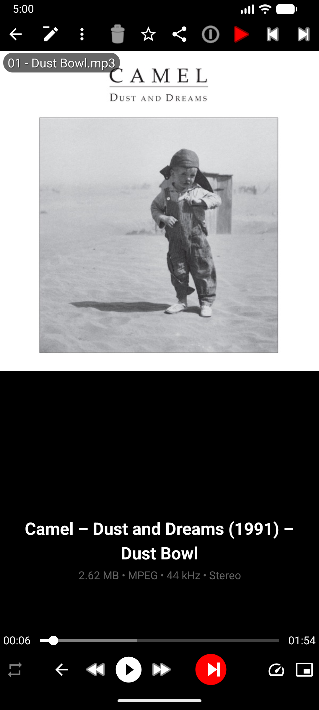
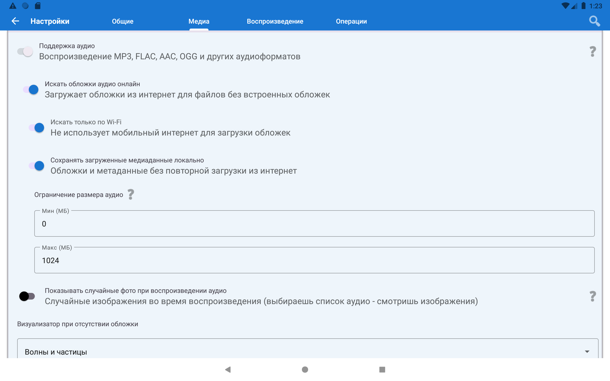
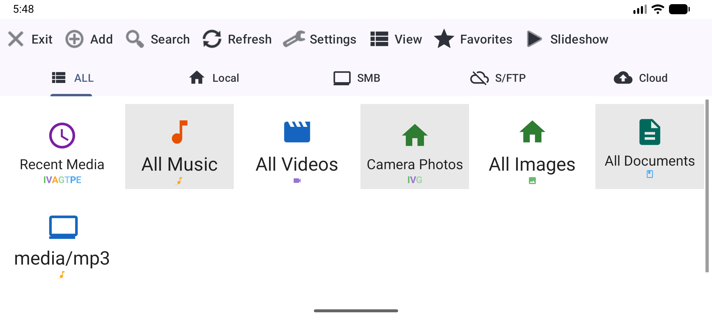
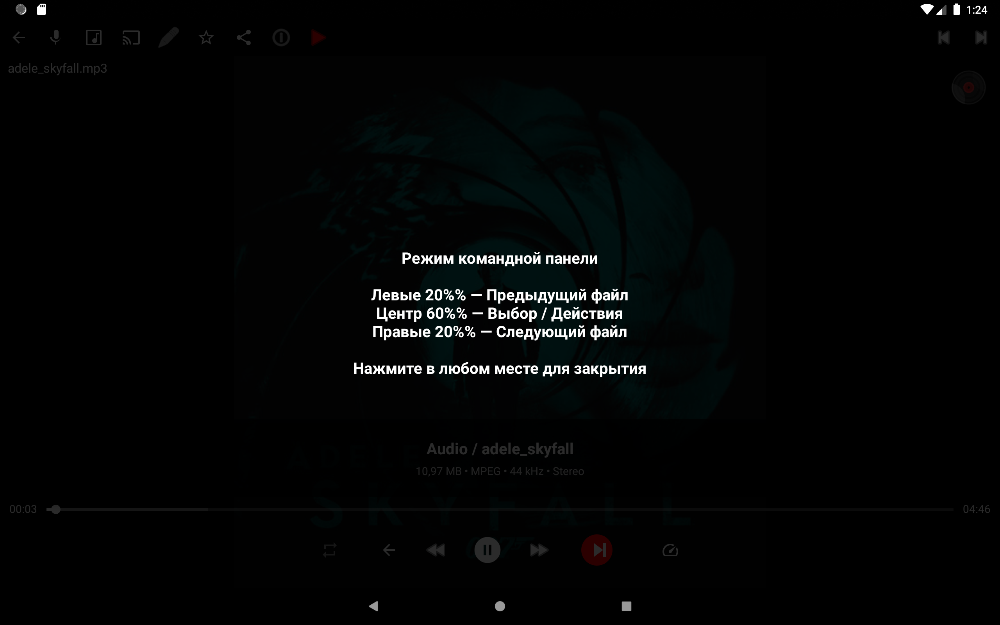

# 🚗 Музика в автомобілі (Android-магнітола)

> **Рівень:** Початківець &bull; **Час:** ~10 хвилин &bull; **Версія:** Standard або Legacy

[English](scenario-car-music.md) | [Русский](scenario-car-music-ru.md)

FastMediaSorter чудово працює як автомобільний музичний плеєр на Android-магнітолах - миттєвий доступ до всієї колекції з SD-картки або USB, з підтримкою кнопок керма «з коробки».

> **Що таке Android-магнітола?** Це автомобільна магнітола з сенсорним екраном, яка працює на Android - як телефон, але вбудований у торпедо. Цей посібник також підійде для звичайного телефону або планшета, закріпленого в машині.

---

## Що вам знадобиться

- Android-магнітола / телефон / планшет в автомобілі
- Музичні файли на **SD-картці**, **USB-накопичувачі** або **внутрішній пам'яті** (MP3, FLAC, AAC, OGG та інші)
- (Необов'язково) Кнопки керування на кермі

---

## Крок 1 - Додайте папку з музикою

1. Відкрийте застосунок
2. Натисніть **Додати (⊕)** на панелі інструментів
3. Оберіть **"Локальна папка"**
4. Перейдіть до місця, де зберігається музика:
   - **SD-картка:** у папці `/storage/` шукайте підпапку з кодом виду `1234-5678`, музика зазвичай у `/storage/1234-5678/Music`
   - **Внутрішня пам'ять:** спробуйте `/sdcard/Music` або `/sdcard/Download`
   - **USB-накопичувач:** шукайте `/storage/usb0/` або `/storage/usbdisk/`
5. Оберіть папку → натисніть **Вибрати**

> **Не можете знайти музику?** Натисніть **Додати (⊕)** → **"Локальна папка"** і пошукайте папку з назвою `Music` в будь-якому місці списку. На більшості пристроїв вона знаходиться одразу.

---

## Крок 2 - Налаштуйте папку для музики

Довге натискання на папку з музикою на головному екрані → натисніть **Редагувати (олівець)**.

Відкриються налаштування папки. Встановіть такі параметри:

| Параметр | Значення | Навіщо |
|----------|---------|--------|
| **Профіль** | Аудіотека | Повідомляє застосунку «це папка з музикою» - все налаштовується автоматично |
| **Підтримувані типи** | Лише аудіо | Приховує фото і відео - показуються лише музичні треки |
| **Сортування** | Назва (А→Я) або Виконавець | Тримає треки в логічному порядку |
| **Включати підпапки** | УВІМК | Якщо музика розкладена по папках виконавців/альбомів - знаходить усі треки |

Натисніть **Зберегти**.

> **Що таке "Профіль"?** Це готовий шаблон налаштувань для конкретного типу вмісту. При виборі "Аудіотека" застосунок сам відображає обкладинки, правильно сортує треки і приховує все, крім аудіофайлів.

---

## Крок 3 - Відкрийте папку і почніть відтворення

1. Натисніть на папку з музикою на головному екрані
2. Всі треки відображаються списком з обкладинками альбомів
3. Натисніть **будь-який трек**, щоб почати відтворення

Відкривається повноекранний **аудіоплеєр** з обкладинкою, прогрес-баром і елементами керування.

---

## Крок 4 - Переконайтесь, що музика не переривається

Цей крок гарантує, що музика продовжує грати при вимкненні екрана, перемиканні застосунків або вхідному дзвінку:

1. Перейдіть у **Налаштування → вкладка Медіа**
2. Прокрутіть до розділу **Аудіо**
3. Переконайтесь, що **"Підтримка аудіо"** увімкнена

Готово. Після цього застосунок реєструється як повноцінний музичний плеєр - елементи керування на екрані блокування і в шторці сповіщень з'являються автоматично.

---

## Крок 5 - Перевірте кнопки керма

Натисніть **Наступний** або **Попередній** на кнопках керма.

**Вони працюють автоматично - жодних налаштувань не потрібно.** FastMediaSorter реагує на всі стандартні медіа-кнопки Android.

> **Кнопки не працюють?** Деякі старі магнітоли надсилають нестандартні сигнали. Спробуйте зайти в Android **Налаштування → Спеціальні можливості** і пошукати параметр «отримувач медіа-кнопок». Якщо не допомагає - використовуйте сенсорні зони екрана (лівий/правий край) - вони працюють ідеально.

---

## Крок 6 - (Необов'язково) "Уся музика" - всі треки в одному місці

Якщо музика розкидана по кількох папках (наприклад, частина на SD-картці, частина у внутрішній пам'яті), віртуальний ресурс **"Уся музика"** збирає все в одному місці автоматично:

1. На головному екрані знайдіть картку **"Уся музика"** - вона зазвичай створюється автоматично при наявності аудіофайлів
2. Якщо її немає: натисніть **Додати (⊕)** → прокрутіть до **Віртуальні ресурси** → оберіть **"Уся музика"**

Тепер усі треки з усіх джерел відображаються в одному списку.

---

## Крок 7 - (Необов'язково) Ярлик на робочому столі для швидкого запуску

Ідеально, якщо ви просто хочете сісти в машину і натиснути одну кнопку для запуску музики:

1. Довге натискання на порожньому місці робочого стола → **Віджети**
2. Знайдіть **FastMediaSorter** → перетягніть віджет **"Ярлик ресурсу"** на робочий стіл
3. Оберіть музичний ресурс
4. Готово - натисніть віджет і музика запускається негайно

---

## Крок 8 - (Необов'язково) Додайте інтернет-радіо

Якщо у вашій магнітолі є мобільний інтернет або Wi-Fi, ви можете додати інтернет-радіостанції прямо в застосунок - без окремого додатку для радіо:

1. Відкрийте головне меню → натисніть **Трансляції**
2. Натисніть **Додати (+)** → вставте URL радіостанції (http/https, .m3u8, RTSP) і натисніть «Зберегти»
3. Або натисніть **Імпорт каталогу** - перегляньте вбудований каталог станцій і додайте за жанром або мовою
4. Натисніть на рядок станції - почнеться вбудоване відтворення аудіо, внизу з'явиться міні-панель з назвою станції та поточним треком
5. Список залишається видимим - перемикайте станції не виходячи з екрана

> **Фонове відтворення:** щоб радіо продовжувало грати при перемиканні застосунків, зайдіть у **Налаштування → Медіа → Плеєр → Фонове відтворення аудіо** і увімкніть його.

Примітка: Трансляції потребують підключення до мережі. У версії Lite підтримуються лише прогресивні http/https аудіопотоки (HLS/DASH/RTSP недоступні).

---

## Готово! Керування плеєром

Поки грає музика, екран - ваш пульт керування:

- **Ліві 20% екрана** → Попередній трек
- **Праві 20% екрана** → Наступний трек
- **Центральні 60%** → Пауза / Відтворення / Меню команд

---

## Вирішення проблем

| Проблема | Що спробувати |
|---------|--------------|
| Кнопки керма не працюють | Перевірте, чи надсилає магнітола стандартні Android події. Деяким потрібно увімкнути «отримувач медіа-кнопок» у Android Налаштування → Спеціальні можливості |
| Музика зупиняється при блокуванні екрана | Увімкніть **"Заборонити сон"** у Налаштуваннях → Загальні. Також перевірте, що «Підтримка аудіо» увімкнена (Крок 4) |
| Немає обкладинки альбому | Увімкніть **"Шукати обкладинки аудіо онлайн"** у Налаштування → Медіа → Аудіо (потрібен Wi-Fi). Вбудовані обкладинки з MP3/FLAC читаються автоматично |
| Не бачу музику на SD-картці | Деякі версії Android обмежують доступ до SD. Спробуйте додати шлях до SD через кнопку **"Огляд.."** у виборі папки - вона відкриває системний файловий менеджер з повним доступом до SD |
| Аудіо заїкається або переривається | Закрийте інші фонові застосунки. Для FLAC-файлів переконайтесь, що у магнітоли достатньо продуктивності |
| Радіо зупиняється при перемиканні застосунків | Зайдіть у Налаштування → Медіа → Плеєр → Фонове відтворення аудіо і увімкніть його |
