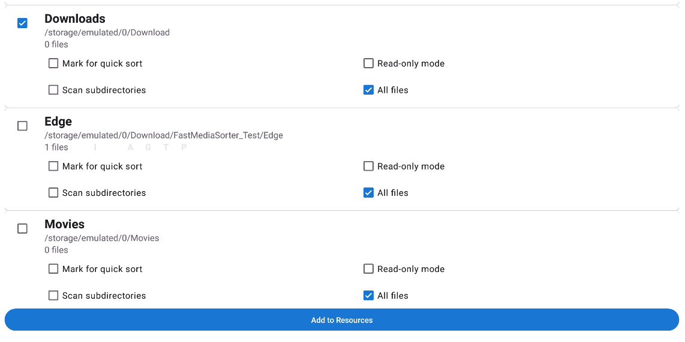
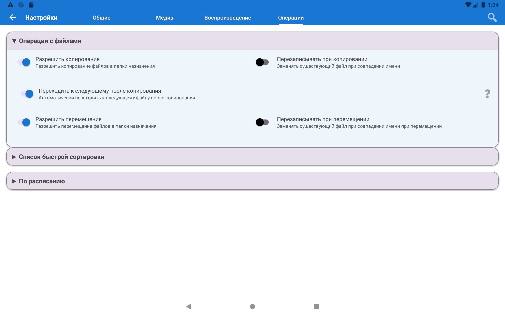
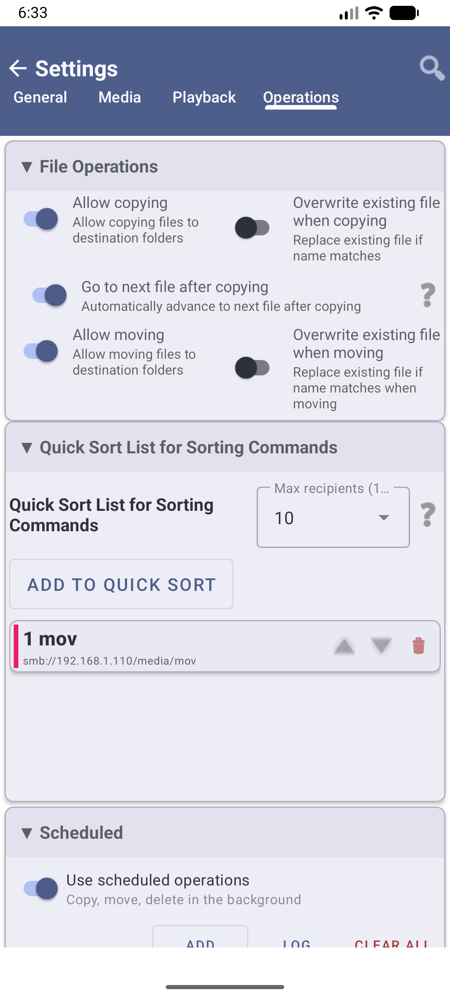
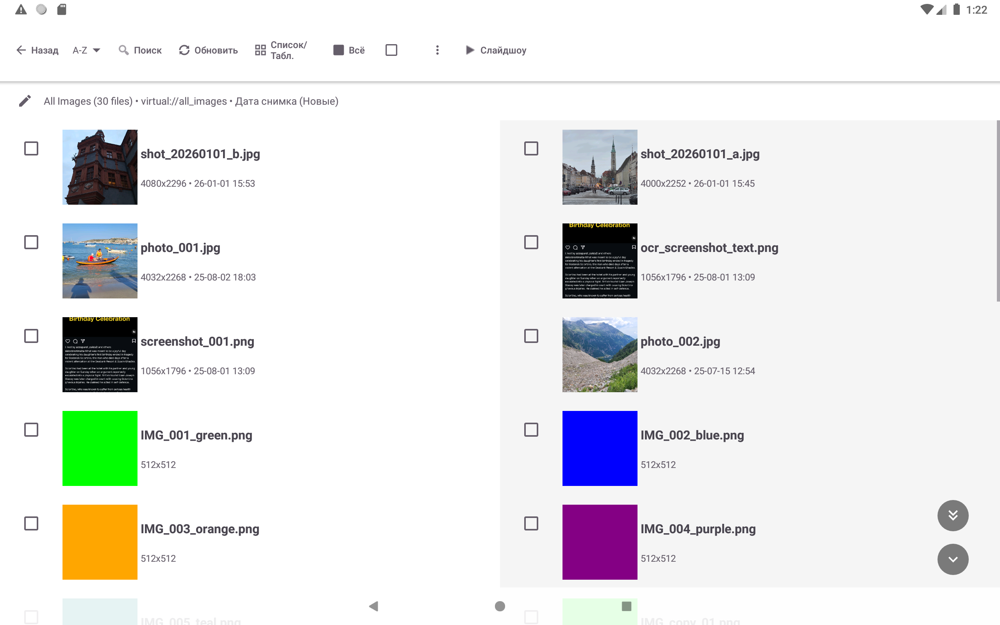
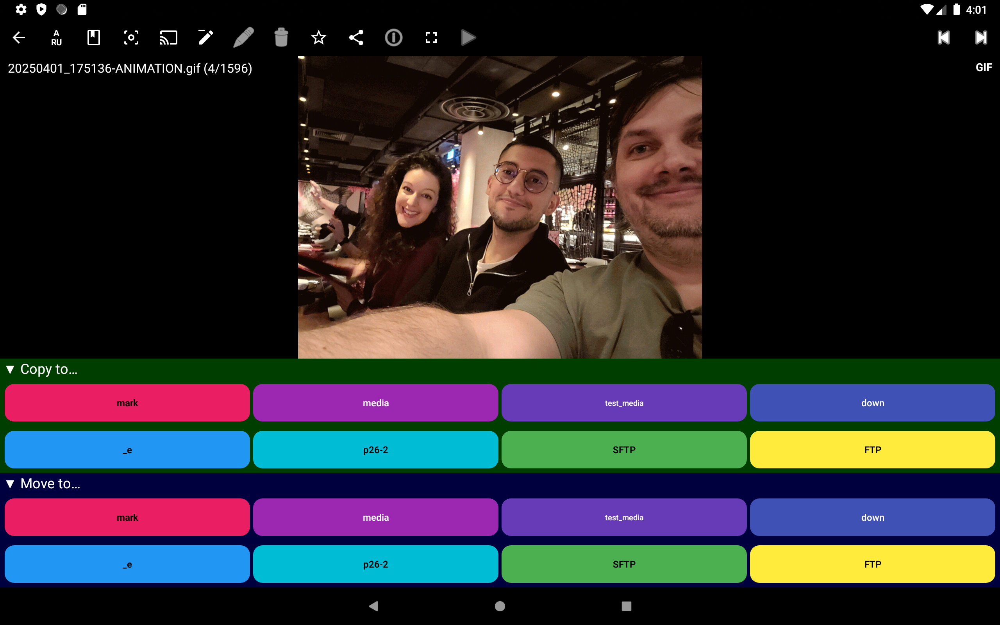
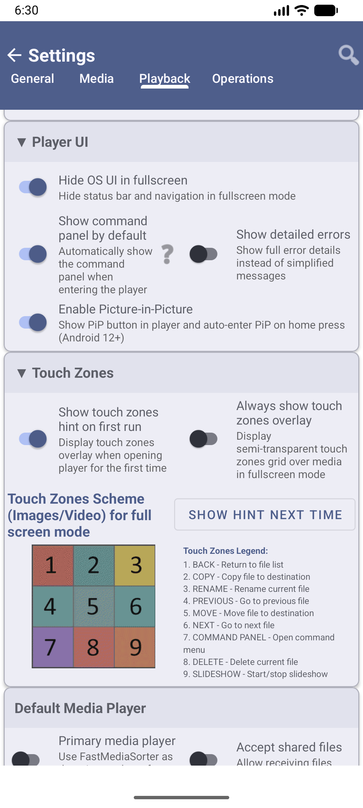

# 🧹 Порядок у завантаженнях — сортування одним дотиком

> **Рівень:** Початківець &bull; **Версія:** Будь-яка (Standard, Lite, Photos, Legacy)

[English](scenario-download-organizer.md) | [Русский](scenario-download-organizer-ru.md)

**Quick Sort** — головна «фішка» FastMediaSorter: налаштуйте папки призначення раз, а потім сортуйте сотні файлів, просто натискаючи цифру. Без перетягування. Без меню. Просто натиснули **1**, **2** або **3** — файл пішов у потрібне місце.

**Реальний приклад:** у вас 200 файлів у папці Завантаження — скриншоти, робочі документи, сімейні фото, меми, чеки. З Quick Sort це все можна розібрати за ~5 хвилин. Без нього — успіхів.

---

## Що вам знадобиться

- Встановлений застосунок (будь-яка версія)
- Папка з файлами для організації (наприклад, Завантаження)
- 2–5 хвилин на первинне налаштування Quick Sort

---

## Крок 1 — Додайте папку Завантаження

1. Відкрийте застосунок
2. Натисніть **Додати (⊕)** на панелі інструментів
3. Оберіть **"Локальна папка"**
4. Знайдіть папку **Завантаження** — зазвичай вона одразу видна з назвою `Download` або `Завантаження`
   - Якщо не видно: спробуйте шлях `/sdcard/Download`
5. Натисніть **Вибрати** (або **ОК**)

Папка з'являється на головному екрані у вигляді картки.

> **Папка Завантаження — це те місце, куди браузер, Telegram, WhatsApp та інші застосунки зберігають файли.** Зазвичай це найбільш захаращене місце на будь-якому телефоні.

---

## Крок 2 — Вирішіть, які категорії вам потрібні

Перш ніж налаштовувати Quick Sort, визначтесь з папками призначення.

Уявіть фізичні папки на робочому столі. Приклади:
- **Робота** — документи, таблиці, PDF від колег
- **Особисте** — сімейні фото, особисті документи
- **Зберегти** — все, що хочеться залишити надовго
- **Кошик** — файли на видалення після перегляду

**Папки можна створити прямо в FastMediaSorter:**
1. Відкрийте ресурс Завантаження
2. Натисніть кнопку **меню (⋮)** → **Створити папку**
3. Введіть назву → натисніть **ОК**

Або створіть папки у звичайному файловому менеджері телефону — вони з'являться у FastMediaSorter автоматично.

---

## Крок 3 — Відкрийте налаштування Quick Sort

1. Натисніть **значок Налаштувань** (⚙ на панелі інструментів)
2. Перейдіть на вкладку **Операції**
3. Натисніть **"Список швидкого сортування"** для розгортання розділу

---

## Крок 4 — Додайте папки призначення до Quick Sort

1. Натисніть **"Додати папку до Quick Sort"**
2. Відкриється вибір папки — перейдіть до першої потрібної папки (наприклад, `Робота`)
3. Натисніть **Вибрати**
4. Папка автоматично отримує **номер (1)** і **колір**
5. Повторіть для кожної папки — підтримується до **30 папок**

> **Номери важливі!** При сортуванні натискаєте **"1"** — файл іде у першу папку, **"2"** — у другу тощо. Покладіть найбільш використовувану папку на перше місце.

---

## Крок 5 — Відкрийте файл для сортування

1. На головному екрані натисніть ресурс **Завантаження**
2. Файли відображаються списком — ви бачите імена та прев'ю файлів
3. Натисніть **будь-який файл**, щоб відкрити його на весь екран

---

## Крок 6 — Сортуйте одним дотиком

Коли файл відкрито на весь екран, подивіться на **нижню частину екрана** — там ряд пронумерованих кольорових кнопок. Кожна кнопка = одна папка Quick Sort.

**СКОПІЮВАТИ файл до папки №1:**
- Натисніть кнопку **"1"** у ряду кнопок

**ПЕРЕМІСТИТИ файл до папки №1** (видаляється із Завантажень):
- **Довге натискання** на кнопку **"1"** → оберіть «Перемістити»
- АБО натисніть **центральну зону** екрана

Файл миттєво відправляється до потрібної папки — і застосунок **автоматично переходить до наступного файлу**. Не потрібно повертатися. Просто продовжуйте натискати цифри.

> **Копіювати чи Переміщати?** «Копіювати» залишає оригінал у Завантаженнях І кладе копію в папку. «Перемістити» відправляє файл у папку і прибирає його із Завантажень. Для прибирання зазвичай потрібно «Перемістити».

---

## Крок 7 — Увімкніть оверлей сенсорних зон (рекомендується для початківців)

Екран поділений на **невидимі зони** — кожна зона при дотику виконує свою дію. Щоб побачити, де вони знаходяться:

1. Зайдіть у **Налаштування → вкладка Відтворення → Сенсорні зони**
2. Увімкніть **"Завжди показувати сітку сенсорних зон"**

Тепер над файлами відображається напівпрозора **сітка 3×3** — завжди видно, куди саме натискати. Дуже допомагає, доки не запам'ятали розташування зон.

---

## Крок 8 — Увімкніть авто-перехід (прискорює сортування)

Після кожного відсортованого файлу застосунок може автоматично відкривати наступний — без додаткових натискань:

Зайдіть у **Налаштування → Операції** → увімкніть **"Переходити до наступного файлу після копіювання"**.

Тепер процес виглядає так: дивитесь на файл → натискаєте цифру → з'являється наступний файл. Папку з 50 файлів можна розібрати менш ніж за 2 хвилини.

---

## Готово! Продовжуйте сортування

Натискайте цифру для кожного файлу:
- **Натиснути 1** → іде до Роботи
- **Натиснути 2** → іде до Особистого
- **Натиснути 3** → іде до Зберегти
- **Провести вниз** → іде до Кошика (можна відновити — файл не видаляється безповоротно)

---

## Поради

> **Помилилися?** Натисніть кнопку **Скасувати** (нижня права область панелі команд) протягом 5 секунд — дія буде скасована.

> **Очистіть кошик після завершення:** Налаштування → Операції → Список Quick Sort → натисніть **"Очистити кошик"** для остаточного видалення файлів.

> **Працює з будь-якою папкою, не лише із Завантаженнями.** Quick Sort підходить для організації фото, музики, документів — будь-якого вмісту.

---

## Вирішення проблем

| Проблема | Що спробувати |
|---------|--------------|
| Не бачу пронумерованих кнопок | Налаштування → Операції → Список Quick Sort — папки мають бути додані туди |
| Файл пішов не до тієї папки | Одразу натисніть **Скасувати** (протягом 5 секунд) |
| Хочу переміщати, а не копіювати | Увімкніть **"Дозволити переміщення"** у Налаштуваннях → Операції, потім довго натискайте цифрову кнопку |
| Файли не відображаються у Завантаженнях | Перевірте Налаштування → Медіа — переконайтесь, що потрібні типи файлів не відфільтровані |
