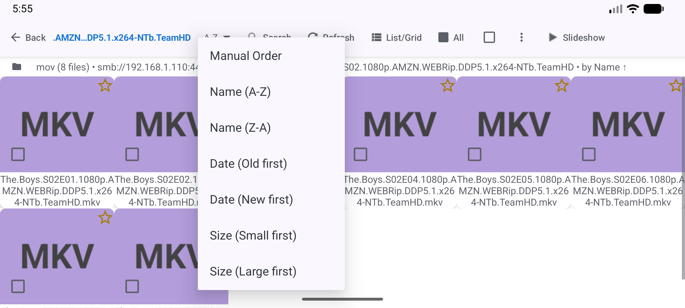
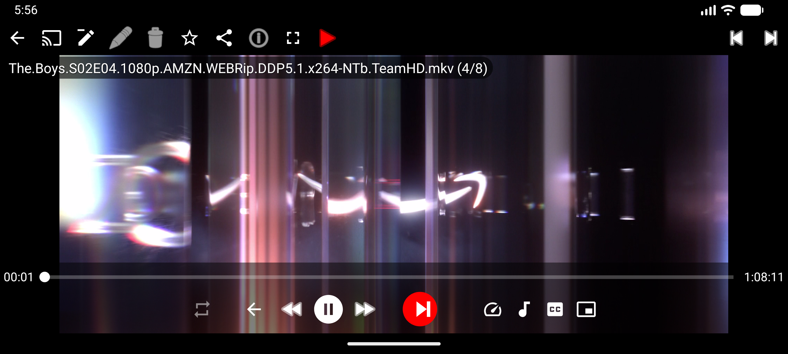

# 🍿 Домашний кинотеатр и VR-стриминг

> **Уровень:** Начинающий &bull; **Время:** ~15 минут &bull; **Версия:** Standard, Legacy, VR, noLegal (в Lite нет сетевых источников, в Photos нет видео)

[English](scenario-home-cinema.md) | [Українська](scenario-home-cinema-uk.md)

Смотрите коллекцию сериалов напрямую с домашнего ПК - на телефоне, планшете или Android-VR-шлеме (Meta Quest, Pico). Без копирования файлов. Без USB-кабелей. Просто нажмите Play.

> **Как это работает?** Телефон и ПК находятся в одной домашней Wi-Fi сети. Приложение подключается к общей папке ПК и стримит видео напрямую - как Netflix стримит со своих серверов, только через вашу домашнюю сеть. Файл на телефон не скачивается - он воспроизводится «на лету».

---

## Что вам понадобится

- Телефон / планшет / VR-шлем в **одной домашней Wi-Fi сети** с ПК
- Видео на **ПК или NAS** (роутер с накопителем)
- Установленный FastMediaSorter

---

## Шаг 1 - Откройте общий доступ к папке с видео на ПК

Сначала сделайте папку с видео доступной по домашней сети.

На **Windows:**
1. Откройте **Проводник**, перейдите в папку с видео (например, `D:\Сериалы`)
2. **Правая кнопка** на папке → **Свойства** → вкладка **Доступ** → кнопка **Общий доступ..**
3. Выберите **Все** (или ваше имя) → нажмите **Добавить** → **Поделиться**
4. Запишите IP-адрес ПК - он понадобится в следующем шаге

> **Как узнать IP ПК:** нажмите **Win + R**, введите `cmd`, нажмите Enter. Введите `ipconfig` и Enter. Найдите строку **IPv4-адрес** под Wi-Fi адаптером. Пример: `192.168.1.100`.

---

## Шаг 2 - Добавьте папку с видео в FastMediaSorter

1. Откройте приложение → **Добавить (⊕)** → **"Сетевая папка SMB"**
2. Нажмите **"Сканировать сеть"** - приложение сканирует домашнюю сеть в поиске ПК
3. Когда ваш ПК появится в списке, нажмите на него - адрес заполнится автоматически
4. Введите имя папки (название общей папки), логин и пароль от Windows
5. Нажмите **Проверить соединение** → **Сохранить**

> **ПК не нашёлся при сканировании?** Введите адрес вручную: `\\192.168.1.100\Сериалы` (замените на ваш IP и имя папки). Все варианты подключения описаны в [Руководстве по настройке SMB](scenario-smb-setup-ru.md).

---

## Шаг 3 - Откройте папку с видео

Нажмите на только что добавленный ресурс на главном экране.

Папки с сериалами и видеофайлы отображаются сеткой с миниатюрами - как при просмотре локальных файлов.

---

## Шаг 4 - Настройте автоматический переход к следующей серии

Чтобы следующая серия запускалась автоматически - не нужно каждый раз выбирать вручную:

1. Вернитесь на главный экран → **долгое нажатие** на ресурс → **Изменить**
2. Установите **Поддерживаемые типы** → **Только видео** (скрывает всё, кроме видеофайлов)
3. Установите **Сортировку** → **По имени (А→Я)** - эпизоды будут идти по порядку
4. Нажмите **Сохранить**

Затем в **Настройках → Операции** включите **"Переходить к следующему файлу после воспроизведения"**.

> **Почему сортировка по имени?** Файлы эпизодов обычно называются `S01E01`, `S01E02` и т.д. Сортировка по имени автоматически расставляет их в правильном порядке.

---

## Шаг 5 - Начните просмотр

1. Откройте папку, перейдите в подпапку с сериалом
2. Нажмите **Эпизод 1** - видеоплеер немедленно открывается и начинает стриминг
3. Видео воспроизводится по Wi-Fi - загружать ничего не нужно

---

## Шаг 6 - Управление во время просмотра

**Сенсорные жесты:**
- **Провести влево** → следующий эпизод
- **Провести вправо** → предыдущий эпизод
- **Нажать экран** → показать / скрыть элементы управления
- **Щипок** → увеличить / уменьшить (полезно для широкоэкранных фильмов на вертикальном телефоне)
- **Двойной тап по левому / правому краю** → перемотка на 10 секунд назад / вперёд

При включённом **"Авто-переходе"** следующий эпизод запускается автоматически - как в Netflix.

---

## Шаг 7 - Для VR-шлемов (Meta Quest, Pico)

> **Этот шаг для владельцев VR-шлемов (Meta Quest 2/3, Pico 4).** Если VR-шлема нет - пропустите.

Android-VR-шлемы могут запускать FastMediaSorter. Установка через sideloading:
1. Скачайте APK со [страницы загрузок](../DOWNLOADS_EN.md)
2. На шлеме включите **"Установка из неизвестных источников"** в настройках разработчика
3. Установите APK через SideQuest или напрямую через ADB

После установки видеоплеер работает точно так же:
- Видео заполняет **виртуальный плоский экран** внутри шлема
- Используйте **триггер контроллера** для нажатия кнопок
- Используйте **стик** для перелистывания эпизодов
- Обычные 2D-фильмы и сериалы - работают сразу, без лишних настроек

> **Для полноценного VR-кино:** используйте специальное VR-приложение-плеер как лаунчер, а FastMediaSorter - для навигации по файлам. Или откройте файл через FastMediaSorter → «Открыть во внешнем приложении» для запуска в VR-плеере.

---

## Готово! Что попробовать дальше

- Добавьте ресурс **Google Drive** или **Dropbox** для фильмов в облаке - работает так же
- Используйте **Избранное** (нажмите ★ во время просмотра) для закладки текущего сериала
- **Субтитры:** если рядом с видеофайлами лежат `.srt`-файлы субтитров, нажмите кнопку **CC / субтитры** на панели плеера

---

## Решение проблем

| Проблема | Что попробовать |
|---------|----------------|
| Видео зависает или буферизуется | Запустите **тест скорости**: долгое нажатие на ресурс → Изменить → Тест скорости. При скорости ниже 5 Мбит/с - переключите телефон на диапазон **5 ГГц** (быстрее, но меньше дальность) |
| Видео не воспроизводится (ошибка формата) | В плеере нажмите **параметры (⋮)** → переключите **Декодер** с «Аппаратного» на «Программный» (медленнее, но совместимее) |
| Эпизоды идут в неправильном порядке | В настройках папки (Изменить) установите сортировку **По имени (А→Я)** |
| Авто-переход не работает | Настройки → Операции → убедитесь, что «Переходить к следующему файлу после воспроизведения» включено |
| VR-шлем не устанавливает APK | Настройки шлема → Разработчик → включите «Разрешить установку из неизвестных источников» |
