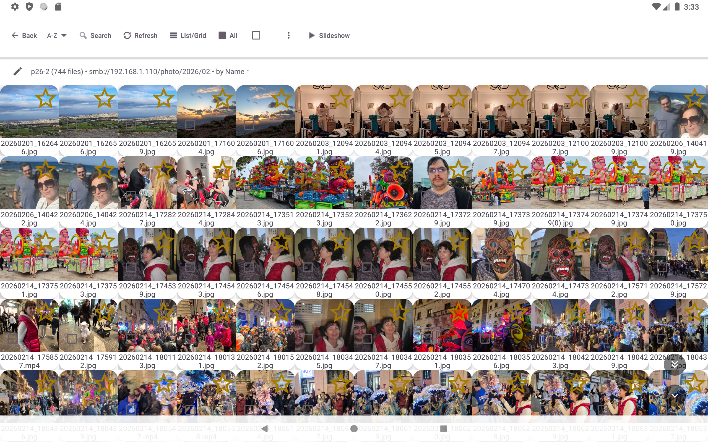
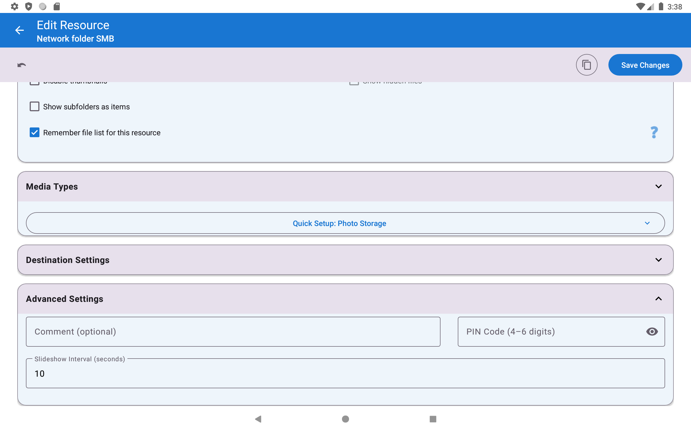
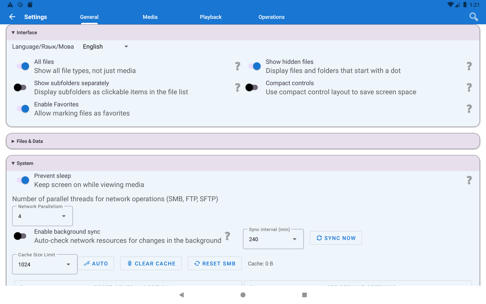
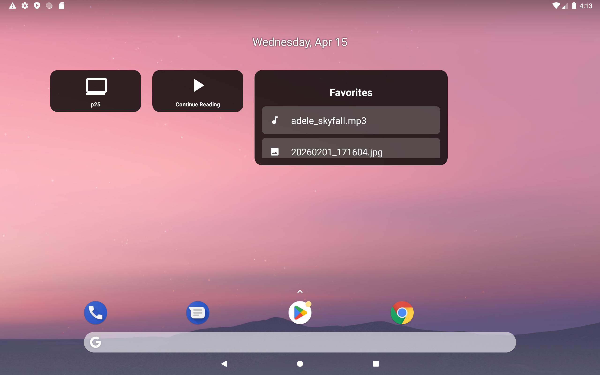

# 🖼️ Цифровая фоторамка на планшете

> **Уровень:** Начинающий &bull; **Время:** ~15 минут &bull; **Версия:** Standard (для NAS/облака) или любая (для локальных фото)

[English](scenario-photo-frame.md) | [Українська](scenario-photo-frame-uk.md)

Превратите любой Android-планшет в красивую всегда включённую цифровую фоторамку — стриминг воспоминаний с домашнего NAS или облака с фоновой музыкой. Память устройства не расходуется.

> **Идея одной фразой:** поставьте старый планшет на подставку, подключите к зарядке, запустите слайд-шоу — он показывает ваши фото автоматически, меняя их каждые несколько секунд. Как настоящая цифровая фоторамка из магазина, только с вашей коллекцией фото из любого источника.

---

## Что вам понадобится

- Android-планшет (любой размер — отлично подойдёт старый!)
- Подставка или крепление
- **USB-зарядка** — планшет будет работать весь день, батарейки не хватит
- Фотографии на одном из: **локальное хранилище**, **домашний ПК/NAS через SMB** или **Google Drive / Dropbox**
- (Необязательно) Источник музыки для фонового воспроизведения

---

## Шаг 1 — Добавьте источник фото

Выберите, где хранятся ваши фото:

**Вариант А — Локальные фото (на самом планшете):**
1. Нажмите **Добавить (⊕)** → **Локальная папка** → перейдите в папку с фото → **Выбрать**

**Вариант Б — Домашний NAS / Windows ПК (SMB):**
1. Нажмите **Добавить (⊕)** → **Сетевая папка SMB**
2. Нажмите **"Сканировать сеть"** → выберите ваш ПК/NAS из списка
3. Введите путь к папке + логин + пароль
4. Нажмите **Проверить соединение** → **Сохранить**

> Полная настройка SMB: [Подключение к NAS (SMB)](scenario-smb-setup-ru.md). Настраивается один раз за ~5 минут, потом работает само.

**Вариант В — Google Drive / Dropbox:**
1. Нажмите **Добавить (⊕)** → **Облачное хранилище** → выберите провайдера
2. Нажмите **Войти** → пройдите аутентификацию в браузере
3. Выберите папку с фото → **Готово**

---

## Шаг 2 — Настройте папку для слайд-шоу

Долгое нажатие на папку с фото на главном экране → нажмите **Изменить (значок карандаша)**.

Установите эти параметры:

| Параметр | Рекомендуемое значение | Зачем |
|----------|----------------------|-------|
| **Интервал слайд-шоу** | 5–10 секунд | 5 с = быстрая смена, как в семейном альбоме; 10 с = спокойно, можно рассмотреть всех на фото |
| **Включать подпапки** | ВКЛ | Показывает фото из всех подпапок — удобно при организации по годам/альбомам |
| **Режим сортировки** | Дата съёмки (новые первыми) или Случайный | Случайный = больше разнообразия каждый день; Дата = последние снимки первыми |
| **Поддерживаемые типы** | Только изображения | Уберите Видео и Аудио — иначе видеофайлы будут прерывать слайд-шоу |

Нажмите **Сохранить**.

---

## Шаг 3 — (Необязательно) Добавьте фоновую музыку

Хотите, чтобы во время просмотра тихо играла музыка? Вот как:

1. Сначала добавьте источник музыки: **Добавить (⊕)** → **Локальная папка** → папка с музыкой
2. Перейдите в **Настройки → вкладка Медиа → раздел Аудио**
3. Включите **"Показывать случайное фото при воспроизведении аудио"**

Затем **Настройки → вкладка Воспроизведение → Сортировка и слайд-шоу**:
4. Включите **"Фоновая музыка для слайд-шоу"**
5. Нажмите **"Выбрать источник музыки"** → выберите папку с музыкой

> **Совет:** если музыка заикается при фото с NAS — используйте локальную папку для музыки, а фото пусть стримятся с сети. Источники можно свободно комбинировать.

---

## Шаг 4 — Запустите слайд-шоу

1. Нажмите на папку с фото на главном экране
2. Нажмите **любое фото** для открытия полноэкранного просмотра
3. Нажмите **"Слайд-шоу" (▶)** на панели инструментов

Всё — слайд-шоу запущено. Фото меняются автоматически с заданным интервалом.

> **Быстрый запуск:** нажмите **нижнюю правую зону** экрана (экран разделён на сетку 3×3 невидимых зон; нижняя правая = зона 9 = ВОСПРОИЗВЕДЕНИЕ).

---

## Шаг 5 — Не давайте экрану гаснуть

**Этот шаг критически важен.** Android гасит экран через несколько минут для экономии заряда — что сломает всю идею фоторамки. Нужно это отключить.

**Вариант А — Настройка в приложении (рекомендуется):**
Перейдите в **Настройки → Общие → раздел Система** → включите **"Запретить сон"**.

Это говорит Android держать экран включённым, пока приложение на переднем плане. Как только вы переключитесь на другое приложение — обычное отключение экрана вернётся.

**Вариант Б — Системные настройки Android:**
Настройки Android → Экран → Время до отключения экрана → выберите **"Никогда"**.

> **Также:** держите планшет **подключённым к зарядке через USB** постоянно. Планшет с работающим слайд-шоу разрядится к вечеру — просто оставьте оригинальную зарядку подключённой.

---

## Шаг 6 — (Необязательно) Виджет на рабочем столе

Это для удобства: хотите запускать фоторамку мгновенно при включении планшета — без открытия приложения и навигации?

1. Долгое нажатие на рабочем столе → нажмите **Виджеты**
2. Найдите **FastMediaSorter** в списке виджетов
3. Перетащите виджет **"Ярлык ресурса"** на рабочий стол
4. При появлении запроса выберите папку с фото
5. Нажмите виджет — слайд-шоу запустится мгновенно

---

## Готово! Ваша фоторамка работает

**Управление во время слайд-шоу:**
- **Нажать экран** → пауза / показать элементы управления
- **Провести влево / вправо** → следующее / предыдущее фото вручную
- **Нажать нижнюю правую зону** → остановить слайд-шоу и вернуться к списку файлов

---

## Советы

> **Фото с NAS не обновляются после добавления новых?** Приложение кэширует список файлов для скорости. Для обновления: вернитесь в папку → нажмите кнопку **Обновить (↻)** на панели инструментов. Новые фото появятся сразу.

> **Фото выглядят обрезанными или с чёрными полосами?** Открыть Настройки → Медиа → Изображения → попробуйте переключить **"Обрезать изображения под размер экрана"** — ВЫКЛ сохраняет фото целиком, ВКЛ заполняет весь экран (небольшая обрézка по краям).

> **Вертикальный телефон как рамка?** Включите "Обрезать изображения под размер экрана" — это уберёт чёрные полосы по бокам у горизонтальных фото.

---

## Решение проблем

| Проблема | Что попробовать |
|---------|----------------|
| Экран гаснет через несколько минут | Включите "Запретить сон" в Настройки → Общие (Шаг 5) **и** подключите USB-зарядку |
| Фото не отображаются | Настройки → Медиа → убедитесь, что тип "Изображения" включён для этого ресурса |
| Музыка не играет | Проверьте, что папка с музыкой содержит хотя бы один аудиофайл; проверьте Настройки → Воспроизведение → Фоновая музыка включена |
| Слайд-шоу останавливается на видео | Ожидаемо — видео воспроизводится, затем слайд-шоу продолжается. Установите "Поддерживаемые тип: только изображения" в настройках папки (Шаг 2) |
| Фото с NAS загружаются медленно | Изменить папку → отключите "Загружать миниатюры". Или уменьшите интервал слайд-шоу, чтобы дать больше времени на загрузку |
| Фото слишком быстро меняются | Увеличьте интервал слайд-шоу в настройках папки (Шаг 2) |
