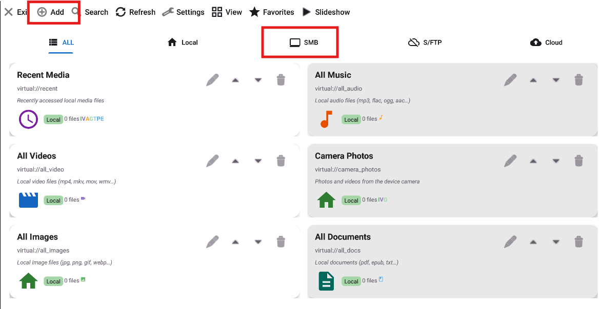
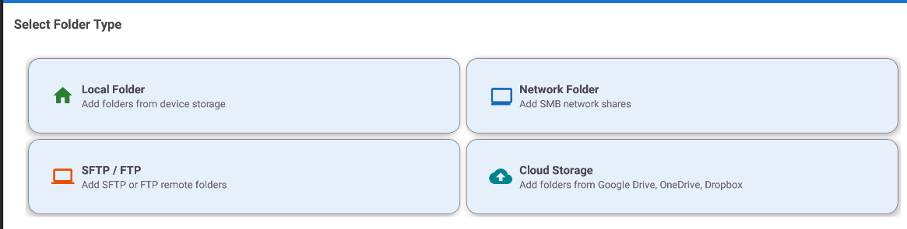
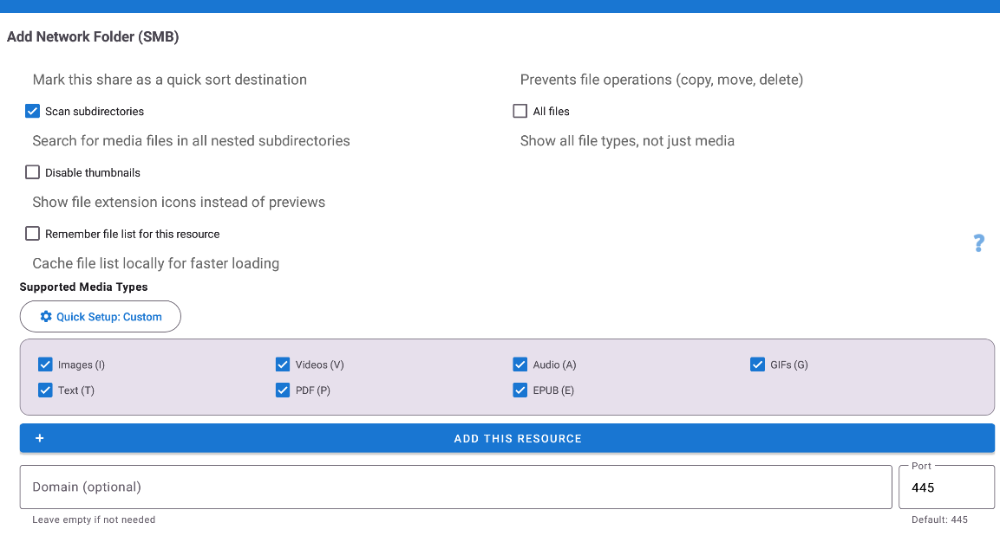
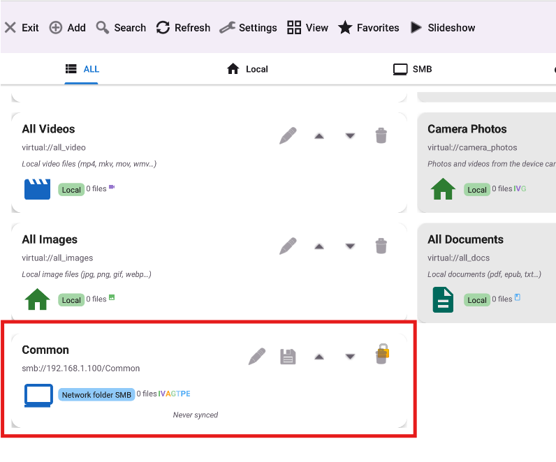

# 🖥️ Подключение к домашнему NAS / Windows (SMB)

> **Уровень:** Начинающий &bull; **Версия:** Standard, Lite, Photos, Legacy (все поддерживают SMB)

[English](scenario-smb-setup.md) | [Українська](scenario-smb-setup-uk.md)

SMB (также Windows File Sharing или CIFS) позволяет просматривать файлы на домашнем ПК, ноутбуке или NAS прямо с телефона - без кабелей и USB, только по Wi-Fi.

> **Простыми словами:** представьте, что ваш ПК выставил «публичную доску объявлений» в вашей домашней Wi-Fi сети. Любое устройство в доме может подключиться к этой «доске» (вашей общей папке) и просматривать файлы, как если бы они хранились прямо на телефоне. Ничего не копируется заранее - файлы открываются по запросу.

---

## Что вам понадобится

- Телефон и ПК / NAS в **одной Wi-Fi сети** (один роутер)
- **IP-адрес** вашего ПК или NAS (например, `192.168.1.100`)
- **Имя общей папки** (например, `Photos`)
- **Логин и пароль** для этой папки (или гостевой доступ)

> **Не знаете этих терминов?** Не беспокойтесь - шаги 1 и 2 объяснят, где всё это найти.

---

## Шаг 1 - Узнайте IP-адрес вашего ПК

IP-адрес - это «домашний адрес» вашего ПК в Wi-Fi сети. Он нужен, чтобы телефон знал, куда обращаться.

На **Windows:**
1. Нажмите `Win + R`, введите `cmd`, нажмите Enter - откроется чёрное текстовое окно
2. Введите `ipconfig` и нажмите Enter
3. Найдите **IPv4-адрес** в разделе вашего Wi-Fi адаптера - например, `192.168.1.100`

> Нужная строка называется **"IPv4-адрес"** (не IPv6, который выглядит как длинный набор букв и цифр). В большинстве домашних сетей она начинается с `192.168.`.

На **NAS** (Synology, QNAP и др.):
- Откройте веб-панель NAS → Настройки сети - там будет указан IP

> Запишите IP - он понадобится на шаге 6.

---

## Шаг 2 - Найдите имя общей папки

«Имя общей папки» - это публичное название вашей папки в сети. Оно может совпадать с названием папки, а может быть другим.

На **Windows:**
1. Откройте **Проводник**
2. Щёлкните правой кнопкой по нужной папке → **Свойства**
3. Перейдите на вкладку **Доступ**
4. Посмотрите **Сетевой путь** - например, `\\DESKTOP-ABC\Photos`
5. Часть после последнего `\` - это **имя папки** (здесь: `Photos`)

> **Папка ещё не открыта для общего доступа?** Нажмите **Общий доступ..** → выберите **Все** → **Добавить** → **Поделиться**. Windows сразу покажет вам сетевой путь.

> **Важно:** убедитесь, что в Windows включены **Обнаружение сети** и **Общий доступ к файлам**. Панель управления → Центр управления сетями → Изменить параметры общего доступа → включите «Сетевое обнаружение» и «Общий доступ к файлам и принтерам».

---

## Шаг 3 - Откройте FastMediaSorter и нажмите "+"

1. Откройте приложение
2. На **главном экране** нажмите кнопку **Добавить (⊕)** на панели инструментов

---

## Шаг 4 - Выберите "Сетевая папка SMB"

В списке типов ресурсов нажмите **"Сетевая папка SMB"** (или вкладку SMB).

---

## Шаг 5 - Попробуйте автоматическое обнаружение

Нажмите кнопку **"Сканировать сеть"**. Приложение найдёт устройства с SMB-папками в вашей Wi-Fi сети.

- Подождите ~10 секунд
- Появится список найденных устройств
- Нажмите на ваш ПК или NAS - IP-адрес заполнится автоматически

<!-- TODO screenshot: Scan Network in progress - spinner or "Scanning.." text -->

<!-- TODO screenshot: Scan results list showing one or more found devices -->

> **Ничего не нашлось?** Не страшно - переходите к шагу 6 и введите IP вручную. Это бывает, когда роутер использует AP Isolation (настройка безопасности, блокирующая связь между устройствами). Ввод IP вручную всегда работает.

---

## Шаг 6 - Заполните параметры подключения

Заполните форму:

| Поле | Что ввести | Пример |
|------|-----------|--------|
| **Сервер / Путь** | `\\IP\ИмяПапки` | `\\192.168.1.100\Photos` |
| **Имя пользователя** | Ваш логин Windows | `ivan` |
| **Пароль** | Ваш пароль Windows | `••••` |
| **Отображаемое имя** | Любое название (необязательно) | `Домашний ПК - Фото` |

> **Входите в Windows через учётную запись Microsoft (email)?** Используйте **полный email-адрес** в качестве логина (например, `ivan@outlook.com`), а не только имя. Пароль - тот же, что при разблокировке ПК.

> **Нет пароля или используется гостевой доступ?** Попробуйте оставить Логин и Пароль пустыми и нажать "Проверить соединение" - некоторые домашние ПК разрешают открытый доступ.

**Форматы адреса:**

| Формат | Пример |
|--------|--------|
| Стандартный Windows | `\\192.168.1.100\Photos` |
| Стиль Linux / macOS | `smb://192.168.1.100/Photos` |
| Подпапка | `\\192.168.1.100\Media\Movies` |
| Нестандартный порт | `smb://192.168.1.100:445/Photos` |

---

## Шаг 7 - Проверьте подключение

Нажмите **"Проверить соединение"**.

- **Зелёное сообщение** = успех → переходите к шагу 8! Осталось чуть-чуть.
- **Красное сообщение** = ошибка → смотрите таблицу ниже. Чаще всего помогает проверить IP и имя папки.

<!-- TODO screenshot: Green "Connection successful" toast or inline success message -->

---

## Шаг 8 - Сохраните и откройте

Нажмите **"Сохранить"**. Новая папка появляется на главном экране со значком SMB.

Нажмите на неё - отобразятся фото, видео и другие файлы в виде миниатюр, как обычная локальная папка.

---

## Готово! Теперь вы можете..

- Просматривать все файлы на ПК с телефона
- Смотреть видео и слушать музыку напрямую - без загрузки
- Копировать или перемещать файлы между телефоном и ПК
- Использовать эту папку для слайд-шоу, фоторамки или автомагнитолы

---

## Решение проблем

| Проблема | Что попробовать |
|---------|----------------|
| "В соединении отказано" | Откройте Брандмауэр Windows → разрешите **TCP-порт 445** входящий. Или временно отключите брандмауэр для проверки |
| "Неверный пароль" | Попробуйте оставить **Имя пользователя пустым** (гостевой доступ). Или при учётной записи Microsoft используйте **полный email** как логин |
| "Хост не найден" | Убедитесь, что телефон и ПК в **одной Wi-Fi сети** и на одном роутере. AP Isolation (настройка роутера) может блокировать связь - попробуйте отключить её в настройках роутера |
| Сканирование ничего не нашло | Отключите VPN на телефоне. Проверьте, что в Windows включено **Сетевое обнаружение** (Панель управления → Центр управления сетями). Введите IP вручную |
| Очень медленный просмотр | Нажмите **Изменить** ресурс → запустите **Тест скорости**. Отключите миниатюры видео для медленных сетей |
| Работает по Wi-Fi, но не по мобильному | Ожидаемо - SMB работает только в локальной сети, через мобильный интернет невозможно |

→ Подробнее: [TROUBLESHOOTING_RU.md](../TROUBLESHOOTING_RU.md)
