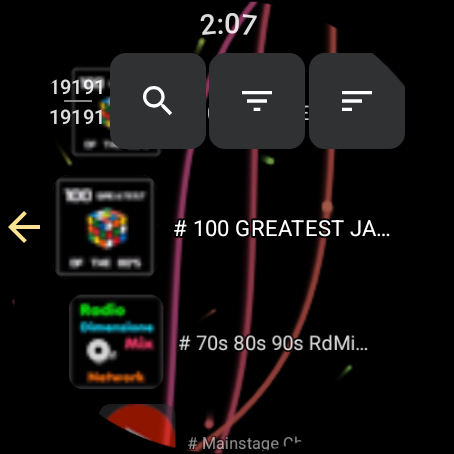

#  Телевизор на смарт-часах

> **Уровень:** Начальный &bull; **Время:** ~10 минут &bull; **Устройство:** Смарт-часы Wear OS

[English](scenario-watch-tv.md) | [Українська](scenario-watch-tv-uk.md)

FastMedia Wear показывает телеканалы и радио прямо на запястье. Часы открывают поток по своему Wi-Fi, поэтому, когда канал уже есть в списке, смотреть можно с телефоном в другой комнате, в сумке или вовсе выключенным.

> **Нужна музыка с диска, а не эфир?** Смотрите [Музыка на смарт-часах](scenario-watch-music-ru.md). Для своих файлов на NAS или общей папке ПК - [Подключение часов к сетевым ресурсам](scenario-watch-network-ru.md).

---

## Что вам понадобится

- Смарт-часы с **Wear OS 2.0** или новее и установленным FastMedia Wear
- Сеть Wi-Fi, к которой часы могут подключиться, либо сопряжённый телефон для передачи соединения
- По желанию - FastMediaSorter на Android-телефоне, если хотите отправлять на часы свои каналы

---

## Шаг 1 - Откройте раздел Streams

1. Запустите **FastMedia Wear** на часах.
2. На главном экране нажмите **Streams**.

Шесть разделов на главном экране всегда стоят на одних и тех же местах, поэтому Streams находится в нижнем ряду при любом размере сетки. Над ними - ряд недавно открытых ресурсов: как только вы что-то посмотрели, канал появляется там и открывается одним касанием.

---

## Шаг 2 - Наполните список каналов

Сразу после установки каналов ещё нет, и экран об этом прямо говорит.

Наполнить его можно двумя способами, и они дополняют друг друга:

- **Скачать общий каталог.** Нажмите **Refresh catalog**. Часы загрузят опубликованный банк каналов одним архивом - много тысяч теле- и радиоканалов с темами, языками и странами.
- **Отправить каналы с телефона.** Канал, который вы добавили сами в FastMediaSorter на телефоне, отправляется командой **Send to watch** из списка трансляций. Каналы, закреплённые на телефоне, к тому же поднимаются в верхнюю группу списка на часах - те два-три, которые вы действительно смотрите, оказываются доступны без прокрутки. Если снять закрепление на телефоне, канал уйдёт из этой верхней группы.

Каналы, присланные с телефона, переживают обновление каталога: обновление заменяет общий банк и не трогает ваши собственные строки.

---

## Шаг 3 - Найдите нужный канал

Три кнопки над списком закреплены и не уезжают вверх вместе с прокруткой.

- **Поиск** фильтрует список по мере ввода.
- **Фильтр** сужает выбор по теме и языку. Названия показаны на языке интерфейса, а не сырой английской латиницей каталога, отсортированы по населённости, с числом каналов в каждой строке, а три языка самого приложения стоят сверху.
- **Сортировка** предлагает «Чаще всего», «Название А-Я», «Название Я-А» и «По типу». По умолчанию - «Чаще всего», и этот порядок растёт от каналов, которые вы реально запускали на часах, так что список сам подстраивается под ваши привычки.

Над списком небольшой счётчик в две строки показывает, сколько каналов осталось после текущего поиска и фильтров, и каков размер всего каталога.

В режиме сетки видеоканал показывает картинку-превью ещё до первого просмотра - из загружаемого набора превью. После первого просмотра её заменяет кадр, снятый с самого канала.

---

## Шаг 4 - Смотрите

1. Нажмите на канал - откроется полноэкранный видеоплеер.
2. **Громкость:** поворачивайте безель или коронку.
3. **Перемотка:** долгое нажатие на кнопку «предыдущий» или «следующий». Обе кнопки остаются на экране даже для одного канала.
4. **Кадр:** кнопка режима кадра переключает вписывание всей картинки в круглое стекло и обрезку по краям во весь экран. Часы запоминают выбор - он переживает выход из плеера и перезапуск приложения, и один и тот же выбор действует для ваших видеофайлов.
5. **Закрепление:** отметка в плеере закрепляет канал. Закреплённые каналы идут первыми при следующем открытии Streams. Отметка привязана к адресу канала, поэтому переживает повторный импорт каталога.

> **Видео требует экрана.** Фоновое воспроизведение продолжает **звук** после выхода из приложения - это удобно для радиоканалов, - но видео и слайд-шоу останавливаются, когда приложение уходит с экрана. Так задумано: видео, которого не видно, только сажает батарею.

---

## Шаг 5 - Возвращайтесь одним касанием

- **Ряд недавнего** на главном экране показывает последний проигранный канал рядом с недавно открытыми сетевыми ресурсами, со значком самого канала. Нажатие открывает плеер.
- **Плитку Stream** можно добавить в карусель плиток Wear OS и назначить на канал прямо с часов. После этого канал находится в одном свайпе от циферблата, и открывать приложение не нужно.
- **Дополнение циферблата «последний ресурс»** тоже показывает канал, так что он может стоять прямо на циферблате.

---

## Шаг 6 - Когда связь слабая

Живой эфир - самая требовательная к сети задача для часов, и приложение об этом говорит прямо:

- Пока идёт трансляция, часы запрашивают у системы широкополосную сеть и отпускают её после окончания.
- Если текущее соединение не тянет поток, часы сообщают об этом, а не молча обрываются.
- Если поток замирает без ошибки - обычный способ смерти живого эфира, - сторож перезапускает его до трёх раз, показывая **Reconnecting**. И только если сеть так и не ожила, появляется сообщение о недоступности канала.

---

## Устранение неполадок

| Проблема | Что попробовать |
|----------|-----------------|
| «No streams available» сразу после установки | Нажмите **Refresh catalog** или отправьте канал с телефона командой **Send to watch** |
| «Could not update streams» | Каталог - это загрузка в несколько мегабайт. Подключите часы к Wi-Fi вместо канала через телефон и повторите |
| Канал открывается и сразу останавливается | Возможно, недоступен сам источник. Часы пробуют три раза, прежде чем сдаться - откройте другой канал, чтобы отличить мёртвый поток от мёртвой сети |
| Видео останавливается, когда опускаешь руку | Так и должно быть: в фоне продолжается только звук. Для прослушивания с погашенным экраном используйте радиоканал |
| Канал, закреплённый на телефоне, не поднялся наверх | Закрепления передаются при включённом Wear-компаньоне в приложении на телефоне - проверьте эту настройку |
| Слишком тихо | Поверните безель или коронку прямо в плеере - это меняет громкость медиа, а не позицию воспроизведения |
