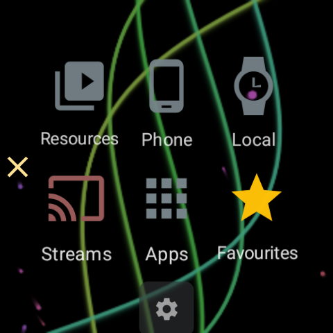
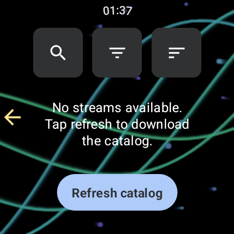

#  Watch TV Channels on Your Smartwatch

> **Level:** Beginner &bull; **Time:** ~10 minutes &bull; **Device:** Wear OS smartwatch

[Русский](scenario-watch-tv-ru.md) | [Українська](scenario-watch-tv-uk.md)

FastMedia Wear plays live TV and radio channels straight on your wrist. The watch opens the stream over its own Wi-Fi, so once a channel is on the list you can watch it with the phone in another room, in a bag, or switched off entirely.

> **Looking for stored music instead?** See [Music on Smartwatch](scenario-watch-music.md). For your own files on a NAS or PC share, see [Connect Watch to Network Shares](scenario-watch-network.md).

---

## What You Will Need

- A smartwatch running **Wear OS 2.0** or newer with FastMedia Wear installed
- A Wi-Fi network the watch can join, or a paired phone to relay the connection
- Optional: FastMediaSorter on your Android phone, if you want to send your own channels to the watch

---

## Step 1 - Open Streams

1. Open **FastMedia Wear** on your watch.
2. On the home screen, tap **Streams**.

The home screen keeps the same six sections in the same places, so Streams is always in the lower row whatever grid size you chose. Above them sits a row of the resources you opened most recently - once you have watched something, the channel you left appears there for a single tap.

---

## Step 2 - Fill the Channel List

A fresh install has no channels yet, and the screen says so.

There are two ways to fill it, and they work together:

- **Download the shared catalogue.** Tap **Refresh catalog**. The watch fetches the published channel bank in one archive - many thousands of TV and radio channels with their topics, languages and countries.
- **Send channels from your phone.** A channel you added yourself in FastMediaSorter on the phone can be pushed across with **Send to watch** from the phone's stream list. Channels you pin on the phone are also raised into the top group of the watch's list, so the two or three you actually watch are reachable without scrolling. Unpinning on the phone withdraws the channel from that top group again.

Channels sent from the phone survive a catalogue refresh - the refresh replaces the shared bank and leaves your own rows alone.

---

## Step 3 - Find the Channel You Want

The three buttons at the top of the list stay pinned while the list scrolls, so they never scroll out of reach.

- **Search** filters the list as you type.
- **Filter** narrows by topic and by language. The names are shown in your interface language rather than raw catalogue English, most-populated first, with the channel count on each row, and the app's own three languages on top.
- **Sort** offers Most used, Name A-Z, Name Z-A and By media type. Most used is the default and rises with the channels you actually start on the watch, so the list teaches itself your habits.

Above the list, a small two-line counter shows how many channels the current search and filters leave, over the size of the whole catalogue.

In grid mode, a video channel shows a preview picture before you have ever opened it, taken from a downloadable preview set. After your first watch the preview is replaced by a frame captured from the channel itself.

---

## Step 4 - Watch

1. Tap a channel. The video player opens full screen.
2. **Volume:** turn the rotating bezel or crown.
3. **Seek:** long press the previous or next button. Both buttons stay on screen even for a single channel.
4. **Frame:** the frame-mode button switches between fitting the whole picture inside the round glass and cropping it to fill the screen. The watch remembers your choice - it survives leaving the player and restarting the app, and the same choice covers your own video files.
5. **Pin:** the mark on the player pins the channel. Pinned channels are listed first the next time you open Streams. The pin is keyed to the channel address, so it survives a catalogue re-import.

> **Video needs the screen.** Background playback keeps **audio** going after you leave the app - useful for radio channels - but video and slideshows stop when the app leaves the screen. That is deliberate: a video you cannot see only drains the battery.

---

## Step 5 - Come Back in One Tap

- The **home screen's recent row** lists the last channel you played beside the network resources you opened recently, with the channel's own icon. Tapping it reopens the player.
- A **Stream tile** can be added to the Wear OS tile carousel and pointed at a channel from the watch itself. From then on the channel is one swipe from the watch face, with no need to open the app first.
- The **last-resource complication** shows the channel too, so it can sit on the watch face.

---

## Step 6 - When the Link Is Weak

Live streams are the most demanding thing a watch does with its network, so the app is explicit about it:

- While a stream plays, the watch asks the system for a wide-band network and releases it when playback ends.
- If the current link cannot carry the stream, the watch says so rather than failing silently.
- If a stream freezes with no error - the usual way a live feed dies - a watchdog re-anchors and re-prepares it up to three times, showing **Reconnecting**. Only when the network stays dead does it fall back to the channel-unavailable message.

---

## Troubleshooting

| Problem | What to try |
|---------|------------|
| "No streams available" after a fresh install | Tap **Refresh catalog**, or send a channel from the phone with **Send to watch** |
| "Could not update streams" | The catalogue is one download of several megabytes. Put the watch on Wi-Fi rather than a phone-relayed link, and try again |
| A channel opens and then stops | The source itself may be offline. The watch retries three times before giving up - try another channel to tell a dead stream from a dead network |
| Video stops when you lower your wrist | Expected: only audio continues in the background. Use a radio channel if you want to keep listening with the screen off |
| The channel you pinned on the phone is not at the top | Pins travel when the Wear companion is switched on in the phone app; check that first |
| Sound is too quiet | Turn the bezel or crown in the player - it changes the watch's media volume, not the playback position |
